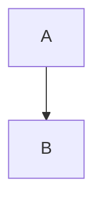

# マークダウン - コードブロックのネストルール

## 基本原則

**外側のコードブロックは、内側よりも多いバッククォートを使用する**

## ルール

### 1. 内側が ``` (3つ) の場合
外側は ```` (4つ) を使用する

```markdown
````
プロンプト例:

```python
def hello():
    print("Hello")
```

上記のように記述してください。
````
```

### 2. 内側が ```` (4つ) の場合
外側は ````` (5つ以上) を使用する

### 3. 複数のネストレベルがある場合
最も多いバッククォート数 + 1 を外側に使用する

## プロンプトガイド作成時の注意点

プロンプト例を示す際、その中にコードブロック記法（```）を含む場合は、必ず外側を ```` (4つのバッククォート) で囲む。

### ❌ 間違い（表示が崩れる）

```markdown
```
プロンプト例:



上記のように記述してください。
```
```

この場合、1つ目の ``` と2つ目の ``` がペアと認識され、Mermaid部分以降の表示が崩れる。

### ✅ 正しい

```markdown
````
プロンプト例:


上記のように記述してください。
````
```

## よくあるパターン

### プロンプト例の中にコードブロックを含む場合

- プロンプトの開始: ````
- プロンプトの終了: ````
- 内部のコードブロック: ```

### プロンプト例の中にMermaid記法を含む場合

- プロンプトの開始: ````
- プロンプトの終了: ````
- 内部のMermaid: ```mermaid

## Obsidianでの表示確認

- Obsidianは標準的なマークダウン記法に準拠
- コードブロックのネストが正しくないと、表示が崩れる
- 作成後は必ずObsidianでプレビュー確認すること

## 教訓

2025年10月24日: プロンプトガイド作成時、ネストされたコードブロックの修正を試みたが、自動修正スクリプトでは完全に対応できなかった。手動での確認と修正が必要。

---

**作成日**: 2025-10-24
**最終更新**: 2025-10-24
