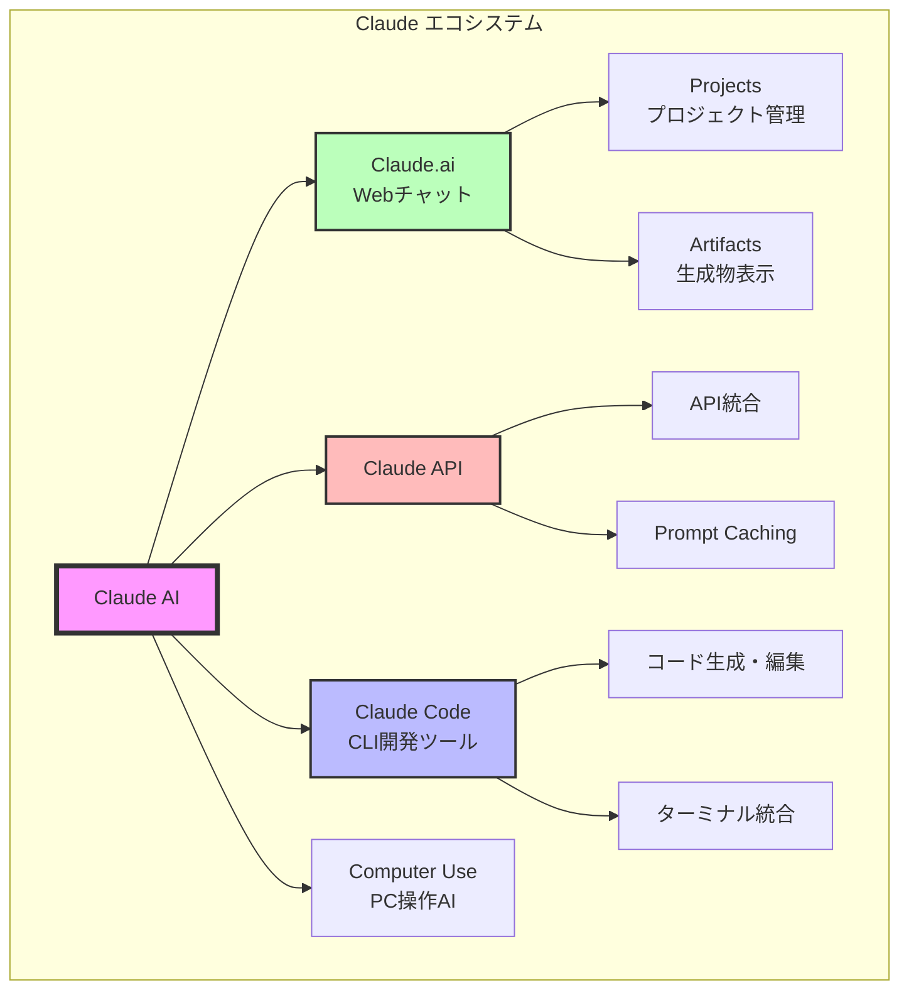
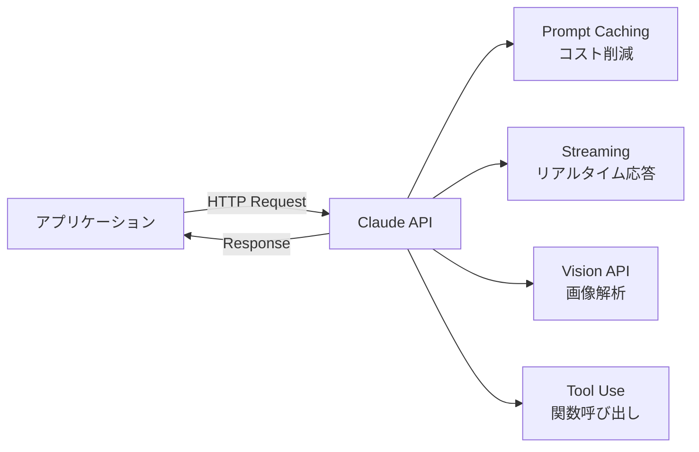
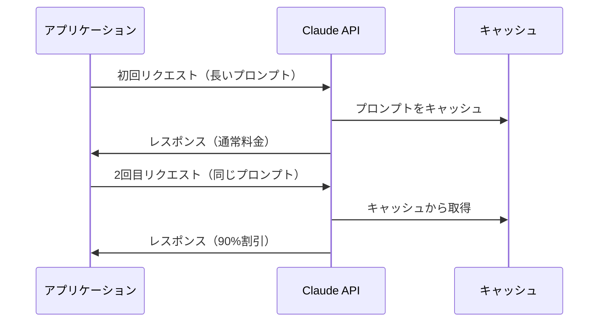
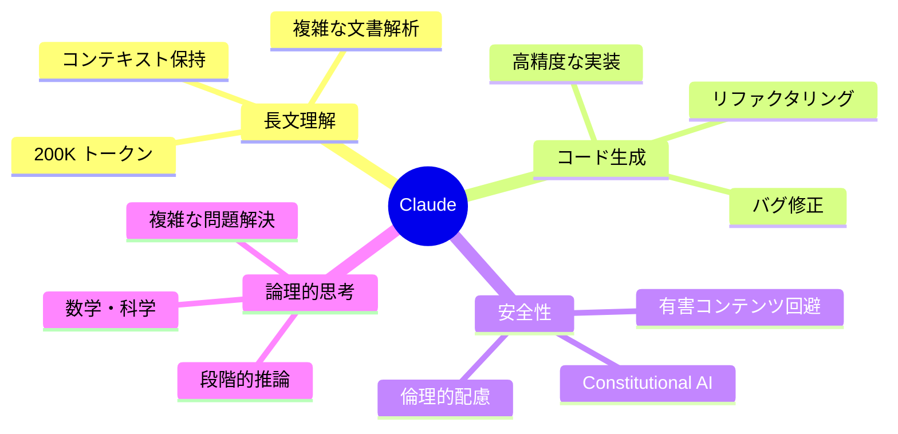
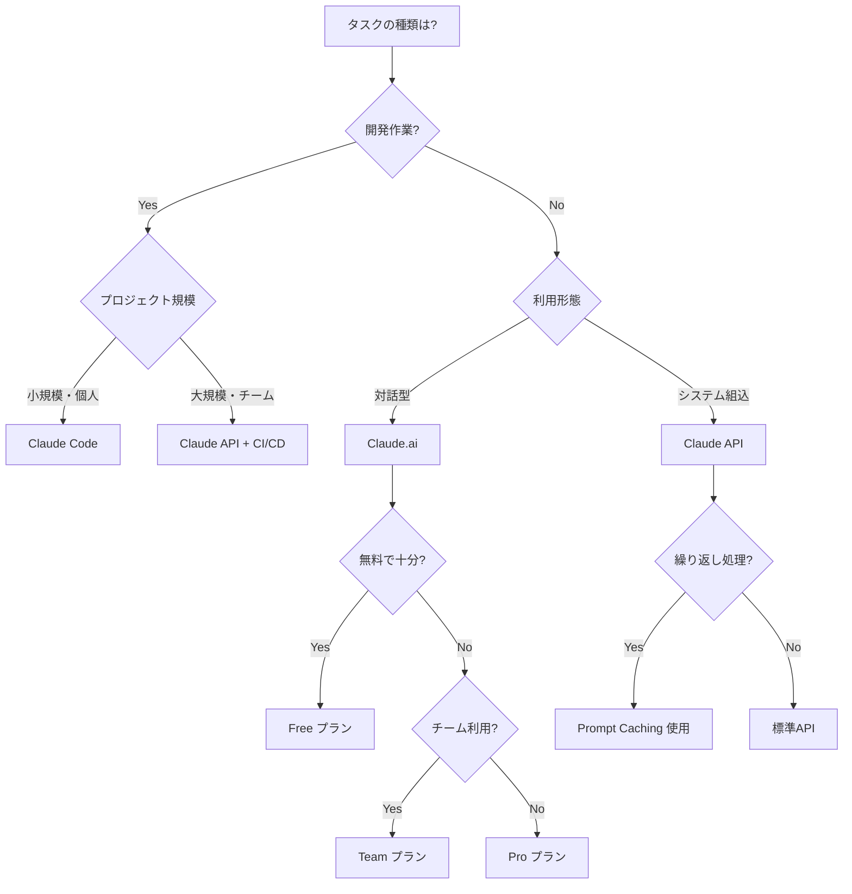

# 第1章: Claude - Anthropicの生成AIエコシステム

Anthropic社が開発するClaudeは、安全性と信頼性を重視した大規模言語モデルです。対話型AIとして、長文理解、コード生成、論理的思考に優れており、開発者からビジネスユーザーまで幅広く利用されています。

## Claudeエコシステム全体像



## 1.1 Claude.ai（Webチャット）

**概要**: ブラウザで利用できる対話型AIインターフェース

### 主な機能
- **長文対応**: 最大200,000トークン（約15万語）のコンテキストウィンドウ
- **マルチモーダル**: テキストと画像の両方を理解
- **リアルタイム対話**: 即座に応答を生成
- **日本語対応**: 高精度な日本語理解と生成

### 料金プラン
| プラン | 月額料金 | 特徴 |
|--------|----------|------|
| Free | $0 | Claude 3.5 Sonnet限定使用 |
| Pro | $20 | 優先アクセス、より多くの使用量 |
| Team | $25/ユーザー | チーム共有、管理機能 |

### 適した用途
- 文書の要約・翻訳
- アイデアのブレインストーミング
- 学習・調査のサポート
- コードの質問・デバッグ

## 1.2 Claude API

**概要**: アプリケーションにClaudeを統合するためのRESTful API

### 主な特徴


### モデルラインナップ（2025年10月時点）

| モデル | リリース日 | 特徴 | 用途 |
|--------|-----------|------|------|
| **Claude Sonnet 4.5** | 2025年9月29日 | 現在のフラッグシップ、最もバランスの取れた性能 | 一般的な対話、コード生成、複雑なタスク |
| **Claude Opus 4.1** | 2025年8月5日 | 最高性能、レガシーブレインストーミングモデル | 複雑な分析、高度な創作 |
| **Claude Haiku 4.5** | 2025年10月15日 | 最新・最速、Sonnet 4の性能を1/3のコストで実現 | 大量処理、チャットボット、コード生成 |

**注意**: Claude 3.5 Opusは計画されていましたが、実際にはリリースされませんでした。Anthropicは3.5シリーズをスキップしてClaude 4シリーズに移行しました。

### API料金（Claude 3.5 Sonnet例）
- **入力**: $3.00 / 1M トークン
- **出力**: $15.00 / 1M トークン
- **Prompt Caching使用時**: 入力コストを90%削減可能

### コード例
```python
import anthropic

client = anthropic.Anthropic(api_key="your-api-key")

message = client.messages.create(
    model="claude-3-5-sonnet-20241022",
    max_tokens=1024,
    messages=[
        {"role": "user", "content": "Pythonで機械学習を始めるには?"}
    ]
)

print(message.content)
```

## 1.3 Claude Code（CLI開発ツール）

**概要**: ターミナルから直接Claudeと対話し、コードを生成・編集できる革新的な開発ツール

**最新バージョン**: Claude Code 2.0（2025年9月29日リリース）+ Web版（2025年10月20日リリース）

### 主な機能
- **ファイル編集**: プロジェクト内のファイルを直接編集
- **コマンド実行**: bashコマンドを実行してテスト・ビルド
- **コンテキスト理解**: プロジェクト全体を把握した上で提案
- **対話型開発**: 自然言語で開発要件を伝えて実装

### Claude Code 2.0 の新機能（2025年9月）

#### Checkpoints（チェックポイント機能）
各変更前にコード状態を自動保存。Escキー2回または`/rewind`コマンドで即座に前のバージョンに戻せます。

#### Plan Mode（計画モード）
リサーチと分析を実行から分離。Claudeはプランを承認するまでファイルを編集したりコマンドを実行したりしません。

#### Agent Skills（エージェントスキル）
バージョン2.0.20から追加された新機能。エージェントがより高度なタスクを自律的に実行できます。

#### Sandboxing & Security（サンドボックス化とセキュリティ）
ファイルシステムとネットワークの分離により、許可プロンプトを削減し、ユーザーの安全性を向上。

### Claude Code for Web（2025年10月）
非同期コーディングエージェント。「Teleport」機能でチャット履歴と編集ファイルをローカルのClaude Code CLIにコピーできます。

### インストール
```bash
# npm経由でインストール
npm install -g @anthropic-ai/claude-code

# 実行
claude-code
```

### 使用例
```bash
$ claude-code

Claude Code> このプロジェクトにユーザー認証機能を追加して

[Claude Codeがファイルを分析]
[必要なファイルを自動生成・編集]
[テストを実行して動作確認]

完了しました。以下のファイルを変更しました:
- src/auth.py (新規作成)
- src/app.py (修正)
- tests/test_auth.py (新規作成)
```

### Claude Codeの強み
- プロジェクト全体を理解した実装
- 既存コードとの整合性を保持
- テストを自動実行して品質保証
- Git操作も自然言語で可能

## 1.4 Projects（プロジェクト管理）

**概要**: Claude.aiで複数の会話を整理し、共通のコンテキストを共有する機能

### 特徴
- **ナレッジベース**: プロジェクト固有の情報を登録
- **会話の整理**: 関連する会話をまとめて管理
- **チーム共有**: Team プランでメンバーと共有可能

### 使用例
```
プロジェクト: 新規Webアプリ開発
├── ナレッジ: API仕様書
├── ナレッジ: デザインガイドライン
├── 会話1: フロントエンド設計
├── 会話2: バックエンド実装
└── 会話3: デプロイ設定
```

## 1.5 Artifacts（インタラクティブ生成物）

**概要**: チャット内で生成したコードやドキュメントを実行可能な形で表示

### 対応形式
- **HTMLページ**: Webページをライブプレビュー
- **React コンポーネント**: インタラクティブなUIを即座に表示
- **SVG図形**: グラフィックをリアルタイム生成
- **Mermaid図**: フローチャート、シーケンス図など
- **コードスニペット**: 構文ハイライト付き表示

### 活用例
```
ユーザー: "売上推移を表示する棒グラフをReactで作って"

Claude: [Artifactとしてインタラクティブな棒グラフを生成]
        [ユーザーは即座にブラウザ上で確認可能]
```

## 1.6 Computer Use（コンピュータ操作AI）

**概要**: Claudeがデスクトップ画面を見て、マウスとキーボードを操作できる画期的な機能（ベータ版）

### できること
- **画面認識**: スクリーンショットを解析
- **マウス操作**: クリック、ドラッグ
- **キーボード入力**: テキスト入力、ショートカット
- **複雑なタスク**: 複数のアプリを横断した作業

### 使用例
```python
# Computer Use APIを使用したブラウザ操作例
message = client.messages.create(
    model="claude-3-5-sonnet-20241022",
    max_tokens=1024,
    tools=[
        {
            "type": "computer_20241022",
            "name": "computer",
            "display_width_px": 1920,
            "display_height_px": 1080
        }
    ],
    messages=[
        {
            "role": "user",
            "content": "ブラウザでGoogleを開いて「AI最新ニュース」を検索して"
        }
    ]
)
```

### 注意点
- 現在はベータ版機能
- セキュリティとプライバシーに配慮して使用
- 本番環境での使用は慎重に

## 1.7 Prompt Caching

**概要**: 繰り返し使用するプロンプトをキャッシュしてコストを削減

### 仕組み


### コスト削減効果
- **キャッシュヒット時の入力トークン**: 通常の10%のコスト
- **キャッシュ有効期間**: 5分間
- **最適な利用シーン**: 長いコンテキストを持つ対話、RAGシステム

## 1.8 モデルラインナップ比較（2025年10月最新）

```mermaid
quadrant-chart
    title Claude モデル比較（性能 vs コスト）
    x-axis 低コスト --> 高コスト
    y-axis 基本性能 --> 高性能
    quadrant-1 ハイエンド
    quadrant-2 レガシー
    quadrant-3 エコノミー
    quadrant-4 バランス型
    Claude Haiku 4.5: [0.2, 0.75]
    Claude Sonnet 4.5: [0.5, 0.9]
    Claude Opus 4.1: [0.85, 0.85]
```

### モデル選択ガイド（2025年10月版）

| 用途 | 推奨モデル | 理由 |
|------|-----------|------|
| 複雑な分析・推論 | Sonnet 4.5 | 現在のフラッグシップ、最高性能 |
| コード生成 | Haiku 4.5 または Sonnet 4.5 | Haikuは高速・低コスト、Sonnetは高品質 |
| チャットボット | Haiku 4.5 | Sonnet 4の性能を1/3のコストで |
| 長文要約 | Sonnet 4.5 | 大量テキスト処理に最適 |
| 画像解析 | Sonnet 4.5 | Vision機能を持つ最新モデル |
| ブレインストーミング | Opus 4.1 | レガシーだが創造的タスクに強い |

### Haiku 4.5 の性能ハイライト（2025年10月）
- SWE-bench Verified: 73.3%（コーディング能力ベンチマーク）
- Sonnet 4と同等の性能をコーディング、コンピュータ使用、エージェントタスクで達成
- 処理速度は2倍以上、コストは1/3

## 1.9 Claudeの主な用途と強み

### 強みの分野



### 具体的な活用シーン

#### シーン1: ソフトウェア開発
```
要件定義 → 設計 → 実装 → テスト → デプロイ
   ↓         ↓       ↓        ↓        ↓
Claude.ai  API   Claude Code  API    Claude Code
(相談)   (自動化) (実装)    (CI/CD)  (自動化)
```

#### シーン2: コンテンツ制作
- 技術文書の作成・翻訳
- APIドキュメント自動生成
- チュートリアル作成

#### シーン3: データ分析
- ログファイルの解析
- レポート生成
- データ可視化コード生成

#### シーン4: リサーチ
- 論文要約
- 競合調査
- 市場分析

### Claudeを選ぶべき場面

✅ **Claudeが最適**
- 長い文書を扱う作業
- 安全性が重要なアプリケーション
- 複雑な論理的推論が必要
- コードの品質を重視
- プロジェクト全体の理解が必要

⚠️ **他のツールも検討**
- 画像生成が主目的（DALL-E, Imagenが優位）
- 音声処理が必要（Whisper等）
- リアルタイム検索が必須（Gemini等）

## 1.10 まとめ：Claudeエコシステムの選び方



### 料金最適化のポイント
1. **適切なモデル選択**: 用途に応じてHaiku/Sonnet/Opusを使い分け
2. **Prompt Caching活用**: 繰り返しの長いプロンプトでコスト90%削減
3. **バッチ処理**: 可能な場合は複数リクエストをまとめる
4. **トークン管理**: 不要な出力を制限してmax_tokensを適切に設定

---

## 関連リンク
- [Claude.ai 公式サイト](https://claude.ai/)
- [Claude API ドキュメント](https://docs.anthropic.com/)
- [Claude Code GitHub](https://github.com/anthropics/claude-code)
- [料金ページ](https://www.anthropic.com/pricing)
