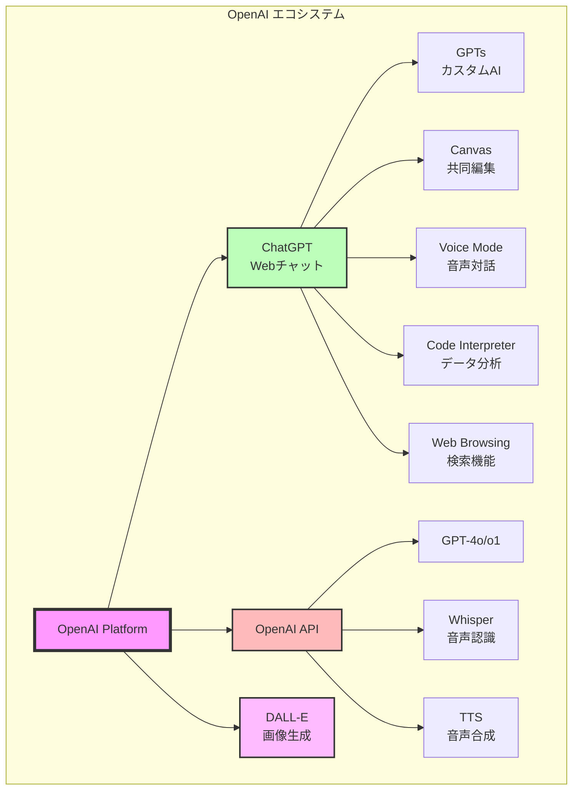
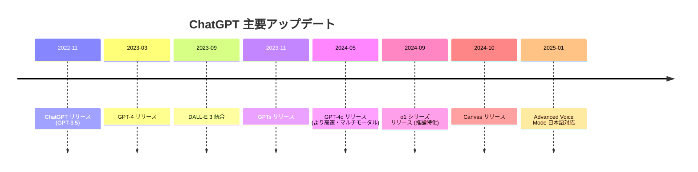
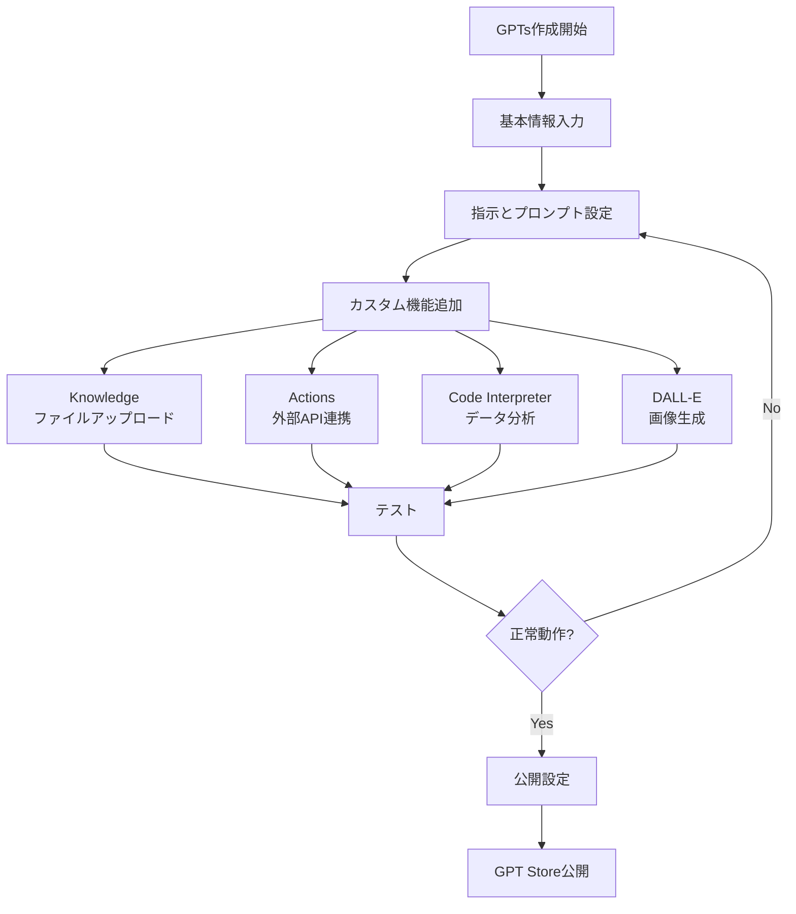
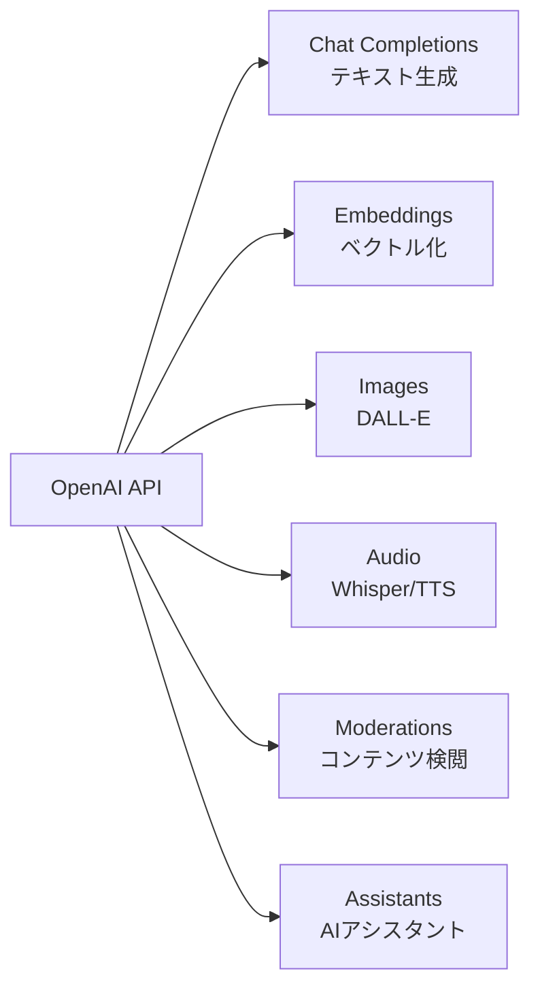
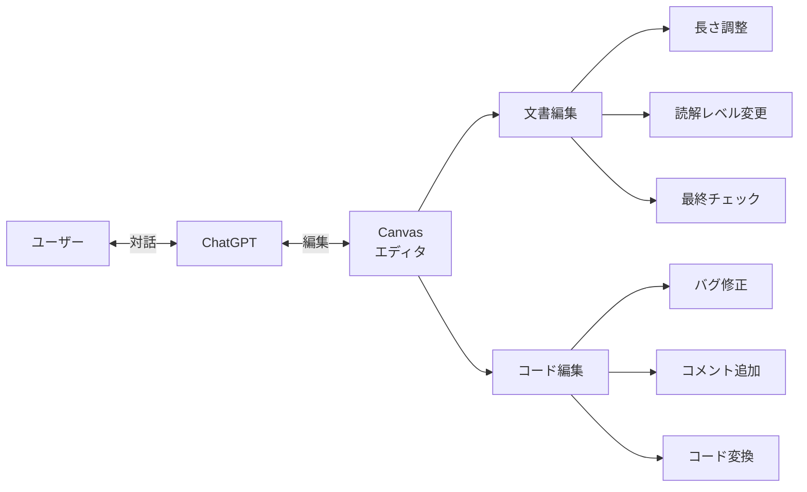
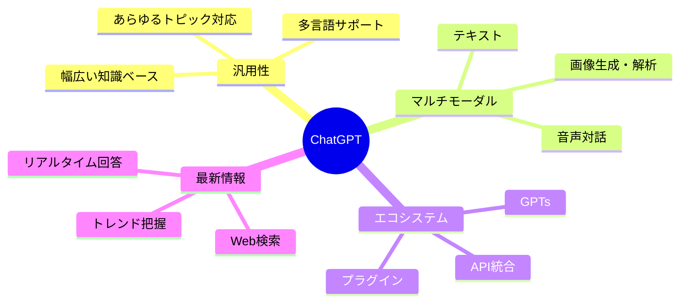
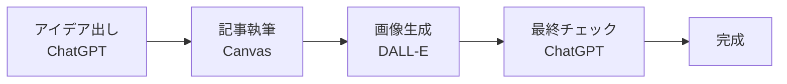
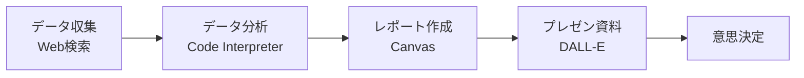
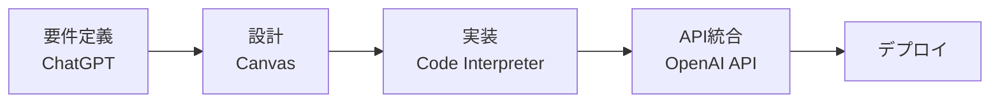
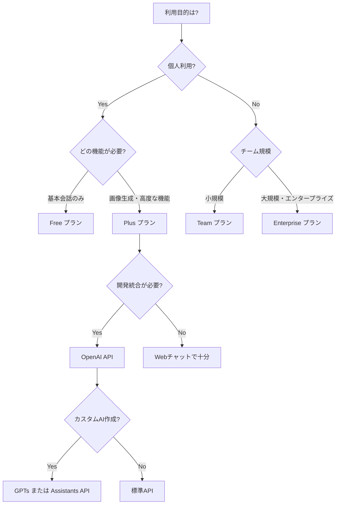

# 第2章: ChatGPT - OpenAIの生成AIプラットフォーム

OpenAIが開発するChatGPTは、世界で最も広く利用されている対話型AIです。GPT-4をはじめとする強力なモデル、DALL-Eによる画像生成、豊富なエコシステムにより、あらゆる用途に対応できる包括的なAIプラットフォームを提供しています。

## ChatGPTエコシステム全体像



## 2.1 ChatGPT（Webチャット）

**概要**: 世界で1億人以上が利用する対話型AIサービス

### 主な機能
- **自然な対話**: 人間のような流暢な会話
- **マルチモーダル**: テキスト、画像、音声に対応
- **Web検索**: リアルタイムの情報取得
- **ファイル分析**: PDF、画像、データファイルのアップロード対応

### 料金プラン（2025年10月時点）

| プラン | 月額料金 | 特徴 |
|--------|----------|------|
| **Free** | $0 | GPT-4o mini、制限あり |
| **Plus** | $20 | GPT-4o、DALL-E、優先アクセス |
| **Team** | $25/ユーザー | チーム共有、管理機能、より高い制限 |
| **Enterprise** | 要相談 | 無制限、セキュリティ強化、専用サポート |

### ChatGPTの進化


## 2.2 GPT-4 / GPT-4o / o1シリーズ / GPT-5

### モデルラインナップ比較（2025年10月最新）

```mermaid
quadrant-chart
    title OpenAI モデル比較（推論能力 vs 応答速度）
    x-axis 低速 --> 高速
    y-axis 基本 --> 高度な推論
    quadrant-1 高速・高性能
    quadrant-2 低速・高性能
    quadrant-3 高速・標準
    quadrant-4 低速・標準
    GPT-4o mini: [0.85, 0.5]
    GPT-4o: [0.7, 0.75]
    GPT-4.1: [0.6, 0.8]
    GPT-4.5: [0.75, 0.85]
    o1-preview: [0.2, 0.92]
    o3: [0.15, 0.98]
    o4-mini: [0.7, 0.85]
    GPT-5: [0.6, 0.95]
```

### 各モデルの特徴

#### GPT-5（2025年8月リリース）
- **統合モデル**: OpenAI最新の統合モデル
- **ルーター機能**: クイック応答用の軽量モデルと深い推論を行う「thinking」モデルをリアルタイムに切り替え
- **汎用性**: あらゆるタスクに対応可能
- **用途**: 次世代の汎用AIアシスタント

#### o3（2025年4月リリース）
- **画像理解と推論の統合**: マルチモーダル推論
- **性能向上**: 数学・科学性能がo1から約30%向上
- **自律ツール呼び出し**: コード実行、Web検索、画像解析・生成を自律的に実行
- **用途**: 高度な問題解決、研究

#### o4-mini（軽量推論モデル）
- **高速動作**: 非常に高速で軽量
- **実用的バランス**: 推論能力と速度のバランス
- **無料プランでも利用可能**: 気軽に使える推論モデル
- **用途**: 日常的な推論タスク、コスト重視

#### GPT-4.5（2025年2月リリース）
- **創造性と感情理解**: 非推論型モデルの最新版
- **高速**: GPT-4oより高速
- **用途**: クリエイティブライティング、感情を伴う対話

#### GPT-4.1（長文脈特化）
- **超長文コンテキスト**: 最大100万トークン対応
- **高速レスポンス**: 長文でも高速処理
- **用途**: 書籍丸ごと分析、大規模コードベース

#### GPT-4o（Omni）
- **統合モデル**: テキスト、音声、画像を単一モデルで処理
- **高速**: GPT-4の2倍の速度
- **コスト効率**: 50%低価格
- **用途**: 汎用的なタスク全般

#### GPT-4 Turbo
- **大容量コンテキスト**: 128,000トークン
- **知識カットオフ**: 2023年12月まで
- **安定性**: 本番環境向け
- **用途**: 長文処理、複雑なタスク

#### o1-preview / o1-mini（推論特化）
- **深い推論**: 複雑な問題を段階的に解決
- **数学・科学**: 高度な計算と論理的思考
- **コーディング**: 複雑なアルゴリズム実装
- **用途**: 研究、難問解決、高度なコード生成

### モデル選択ガイド（2025年10月版）

| タスク | 推奨モデル | 理由 |
|--------|-----------|------|
| 一般的な会話 | GPT-5 または GPT-4.5 | 最新、ルーター機能で最適化 |
| 最高レベルの推論 | o3 | 画像理解含む最高性能 |
| 高速な推論 | o4-mini | 軽量で高速、無料でも利用可 |
| 創造的なライティング | GPT-4.5 | 創造性と感情理解に優れる |
| 超長文処理 | GPT-4.1 | 100万トークン対応 |
| コスト重視 | GPT-4o mini | 低コスト、基本機能十分 |
| データ分析 | o3 または o4-mini | 数学・統計に強い |

## 2.3 GPTs（カスタムAI作成）

**概要**: コード不要で独自のAIアシスタントを作成できる機能

### GPTsの作成方法


### GPTsの活用例

#### 1. 企業向けカスタムAI
```
名前: 社内ヘルプデスクAI
Knowledge: 社内FAQ、マニュアル
Actions: 社内システムAPI連携
用途: 社員からの質問に自動回答
```

#### 2. 教育用AI
```
名前: Python学習チューター
Knowledge: Python入門書、演習問題
Code Interpreter: 有効
用途: プログラミング学習支援
```

#### 3. クリエイティブAI
```
名前: ブログ記事ライター
プロンプト: SEO最適化された記事作成
DALL-E: 有効（アイキャッチ生成）
用途: コンテンツマーケティング
```

### GPT Storeでの配信
- **収益化**: 将来的にGPT作成者への収益分配予定
- **公開範囲**: 全体公開、リンク知っている人のみ、プライベート
- **カテゴリ**: プログラミング、ライティング、研究、生産性など

## 2.4 DALL-E（画像生成）

**概要**: テキストから高品質な画像を生成するAI

### DALL-E 3の特徴
- **高品質**: 詳細で美しい画像生成
- **プロンプト理解**: 複雑な指示を正確に反映
- **ChatGPT統合**: 対話しながら画像を改善
- **著作権保護**: 既存の作品やスタイル模倣を制限

### 生成例とプロンプト
```
プロンプト例1:
"未来都市の夕暮れ、ネオンが輝く高層ビル群、
空飛ぶ車、フォトリアリスティック、8K解像度"

プロンプト例2:
"かわいい猫がコーヒーを飲んでいる、
アニメスタイル、パステルカラー、背景にカフェ"

プロンプト例3:
"ビジネスプレゼンテーション用のインフォグラフィック、
成長を示す矢印、青とオレンジの配色、モダンでミニマル"
```

### DALL-E API料金
- **Standard (1024×1024)**: $0.040 / 枚
- **HD (1024×1792)**: $0.080 / 枚

### 活用シーン
- プレゼンテーション用画像
- ブログ・SNSのアイキャッチ
- プロトタイプのモックアップ
- マーケティング素材

## 2.5 OpenAI API

**概要**: ChatGPTやDALL-Eをアプリケーションに統合

### API種類



### Chat Completions API サンプル

```python
from openai import OpenAI

client = OpenAI(api_key="your-api-key")

response = client.chat.completions.create(
    model="gpt-4o",
    messages=[
        {"role": "system", "content": "あなたは親切なプログラミング講師です。"},
        {"role": "user", "content": "Pythonのリスト内包表記を教えて"}
    ],
    temperature=0.7,
    max_tokens=500
)

print(response.choices[0].message.content)
```

### Function Calling（関数呼び出し）

```python
# AIが必要に応じて関数を呼び出す
tools = [
    {
        "type": "function",
        "function": {
            "name": "get_weather",
            "description": "指定都市の天気を取得",
            "parameters": {
                "type": "object",
                "properties": {
                    "city": {"type": "string", "description": "都市名"}
                },
                "required": ["city"]
            }
        }
    }
]

response = client.chat.completions.create(
    model="gpt-4o",
    messages=[{"role": "user", "content": "東京の天気は?"}],
    tools=tools
)

# AIが get_weather("東京") を呼び出す
```

### API料金（GPT-4o）
| モデル | 入力 | 出力 |
|--------|------|------|
| GPT-4o | $2.50/1M tokens | $10.00/1M tokens |
| GPT-4o mini | $0.15/1M tokens | $0.60/1M tokens |
| o1-preview | $15.00/1M tokens | $60.00/1M tokens |

## 2.6 Canvas（共同編集機能）

**概要**: ChatGPTとリアルタイムで文書やコードを共同編集

### Canvasの特徴


### 使用例

#### 文書編集
```
ユーザー: "マーケティング提案書を書いて"
ChatGPT: [Canvasに提案書を生成]

ユーザー: "もっとフォーマルな表現に変更して"
ChatGPT: [Canvasで文体を調整]

ユーザー: "結論部分を詳しくして"
ChatGPT: [該当箇所を拡張]
```

#### コード編集
```
ユーザー: "Pythonで簡単なWebスクレイパーを作って"
ChatGPT: [Canvasにコードを生成]

ユーザー: "エラーハンドリングを追加して"
ChatGPT: [try-except文を追加]

ユーザー: "このコードをTypeScriptに変換して"
ChatGPT: [TypeScript版を生成]
```

## 2.7 Voice Mode（音声対話）

**概要**: 自然な音声でChatGPTと会話

### Advanced Voice Modeの特徴
- **リアルタイム**: ほぼ遅延なしの対話
- **感情表現**: トーンや抑揚を理解・生成
- **複数言語**: 日本語を含む50言語以上
- **中断可能**: 会話の途中で割り込み可能

### 活用シーン
- **言語学習**: ネイティブスピーカーとの会話練習
- **アイデア出し**: ブレストしながら歩く
- **読み上げ**: 記事やレポートを音声で聞く
- **ハンズフリー**: 運転中や料理中の情報取得

## 2.8 Code Interpreter（データ分析）

**概要**: Pythonコードを実行してデータ分析・可視化

### できること
- **データ分析**: CSV、Excelファイルの解析
- **グラフ作成**: Matplotlib、Seabornでの可視化
- **数値計算**: NumPy、Pandasを使用
- **ファイル変換**: PDF変換、画像処理など

### 使用例

```
ユーザー: [sales_data.csv をアップロード]
        "このデータを分析して、月別売上をグラフにして"

ChatGPT: [Pythonコードを実行]
```python
import pandas as pd
import matplotlib.pyplot as plt

df = pd.read_csv('sales_data.csv')
monthly_sales = df.groupby('month')['sales'].sum()
monthly_sales.plot(kind='bar')
plt.title('月別売上')
plt.savefig('monthly_sales.png')
```

[グラフ画像を表示]

分析結果:
- 最高売上月: 12月（¥5,200,000）
- 最低売上月: 2月（¥2,800,000）
- 平均成長率: 月8.3%
```

## 2.9 Web Browsing（リアルタイム検索）

**概要**: 最新情報をWeb検索して回答に反映

### 検索が有効な質問例
```
❌ 検索不要:
"Pythonのfor文の書き方は?"
→ 基本的な知識で回答可能

✅ 検索が有用:
"2025年のPythonの最新バージョンは?"
→ リアルタイムの情報が必要

✅ 検索が有用:
"今日の為替レートは?"
→ 常に変動する情報

✅ 検索が有用:
"最新のChatGPT機能は?"
→ 最新のアップデート情報
```

## 2.10 ChatGPTの主な用途と強み

### 強みマップ



### 具体的な活用ワークフロー

#### ワークフロー1: コンテンツ制作


#### ワークフロー2: データドリブン意思決定


#### ワークフロー3: アプリ開発


## 2.11 ChatGPTを選ぶべき場面

### ChatGPTが最適

✅ **汎用的なタスク**
- 幅広いトピックに対応
- 専門知識と一般知識の両方

✅ **最新情報が必要**
- Web検索機能
- リアルタイムの情報取得

✅ **画像生成が必要**
- DALL-E統合
- 高品質な画像生成

✅ **音声対話**
- Advanced Voice Mode
- 自然な会話

✅ **カスタマイズ**
- GPTsで独自AI作成
- ノーコードで実現

### 他のツールも検討すべき場合

⚠️ **特定の用途**
- 安全性重視 → Claude（Constitutional AI）
- コーディング特化 → Claude Code, GitHub Copilot
- Google製品統合 → Gemini
- 企業システム統合 → Microsoft Copilot

## 2.12 まとめ：ChatGPTエコシステムの選び方



### 料金最適化のポイント

1. **適切なモデル選択**
   - 簡単なタスク: GPT-4o mini（コスト1/10）
   - 通常タスク: GPT-4o
   - 高度な推論: o1-preview

2. **キャッシュ活用**
   - Prompt Caching（ベータ版）で繰り返しコスト削減

3. **バッチ処理**
   - Batch APIで50%割引（24時間以内の応答で可）

4. **GPTs活用**
   - 社内用途ならGPTsでコスト削減
   - API不要でカスタマイズ可能

---

## 関連リンク
- [ChatGPT 公式サイト](https://chat.openai.com/)
- [OpenAI API ドキュメント](https://platform.openai.com/docs)
- [GPT Store](https://chat.openai.com/gpts)
- [料金ページ](https://openai.com/pricing)
- [DALL-E](https://openai.com/dall-e-3)
