# 第3章: Google - AI統合エコシステム

Googleは検索エンジンやクラウドサービスで培った技術を活かし、包括的なAIエコシステムを構築しています。Gemini、NotebookLM、Google Vidsなど、研究から実用まで幅広いAIツールを提供し、Google製品全体にAIを統合しています。

## Googleエコシステム全体像


## 3.1 Gemini（チャットAI）

**概要**: Googleの最先端マルチモーダルAI。検索エンジンと統合し、リアルタイム情報にアクセス可能

### Geminiモデルラインナップ

```mermaid
quadrant-chart
    title Gemini モデル比較（性能 vs コスト）
    x-axis 低コスト --> 高コスト
    y-axis 基本性能 --> 高性能
    quadrant-1 プレミアム
    quadrant-2 オーバースペック
    quadrant-3 エコノミー
    quadrant-4 バランス型
    Gemini 2.0 Flash: [0.3, 0.8]
    Gemini 1.5 Pro: [0.6, 0.85]
    Gemini 1.5 Flash: [0.2, 0.65]
    Gemini Ultra: [0.9, 0.95]
```

### モデル詳細

| モデル | コンテキスト | 特徴 | 主な用途 |
|--------|-------------|------|----------|
| **Gemini Ultra** | 2M tokens | 最高性能、Deep Think機能 | 高度な推論、研究 |
| **Gemini 1.5 Pro** | 2M tokens | 長文処理に最適 | 文書分析、動画解析 |
| **Gemini 1.5 Flash** | 1M tokens | 高速・低コスト | チャットボット、日常利用 |
| **Gemini 2.0 Flash** | 1M tokens | 最新、マルチモーダル強化 | リアルタイム処理 |

### Geminiの独自機能

#### 1. Google検索統合
```
ユーザー: "2025年の最新AI技術は?"

Gemini: [リアルタイムでGoogle検索を実行]
        [最新記事を参照して回答]
        [出典リンクを表示]
```

#### 2. 超長コンテキスト（2M tokens）
- **1時間の動画**: 全体を一度に解析
- **長大なコードベース**: プロジェクト全体を理解
- **書籍丸ごと**: 1冊分を同時処理

#### 3. マルチモーダル理解


### 料金プラン

| プラン | 月額料金 | 特徴 |
|--------|----------|------|
| **無料版** | $0 | Gemini 1.5 Flash、制限あり |
| **Gemini Advanced** | $19.99 | Ultra、2M tokens、Google One統合 |
| **Business/Enterprise** | 要相談 | Workspace統合、管理機能 |

## 3.2 Gemini API / Google AI Studio

**概要**: Geminiを開発に組み込むためのAPI、AI Studioで簡単にプロトタイプ作成

### Google AI Studioの特徴


### API使用例

```python
import google.generativeai as genai

genai.configure(api_key="your-api-key")

# テキスト生成
model = genai.GenerativeModel('gemini-1.5-pro')
response = model.generate_content("日本の伝統文化について説明して")
print(response.text)

# 画像解析
import PIL.Image

img = PIL.Image.open('photo.jpg')
response = model.generate_content(["この画像の内容を説明して", img])
print(response.text)

# 動画解析（長尺対応）
video_file = genai.upload_file(path="video.mp4")
response = model.generate_content([
    "この動画の要約を作成して",
    video_file
])
print(response.text)
```

### API料金（Gemini 1.5 Pro）
- **入力（128K以下）**: $1.25 / 1M tokens
- **入力（128K超）**: $2.50 / 1M tokens
- **出力**: $5.00 / 1M tokens
- **画像**: $0.00265 / 枚

**無料枠**: 毎分15リクエスト、1日1,500リクエストまで無料

## 3.3 NotebookLM（リサーチAI）

**概要**: 研究・学習に特化したAIノートツール。資料をアップロードして深い理解を得る

### NotebookLMの特徴

```mermaid
flowchart LR
    A[資料アップロード] --> B[NotebookLM]

    A --> C[PDF]
    A --> D[Google Docs]
    A --> E[Webサイト]
    A --> F[YouTube動画]

    B --> G[要約生成]
    B --> H[Q&A]
    B --> I[音声ディスカッション]
    B --> J[ノート作成]

    I --> K[2人のホストが<br/>議論する音声]
```



### NotebookLMの革新的機能

#### 1. 音声要約（Audio Overview）
```
入力: 論文PDF 50ページ

NotebookLM:
[10分間の音声ポッドキャストを自動生成]
- ホスト2人が論文の内容を議論
- 重要ポイントを会話形式で解説
- 理解しやすい日常語で説明
```

#### 2. ソース理解
- 複数の資料を横断的に理解
- 出典を明記した回答
- 資料に基づいた正確な情報

#### 3. 質問応答
```
ユーザー: "この資料でAIの倫理について何と述べている?"

NotebookLM:
[該当箇所を引用]
"第3章で、AIの倫理的使用について以下のように述べています:
「...」(PDF p.45)

また、第7章では...」
```

### 活用シーン
- **学術研究**: 複数の論文を統合理解
- **ビジネス**: 市場調査レポートの分析
- **学習**: 教科書・参考書の要約
- **法務**: 契約書・判例の理解

### 料金
- **完全無料**（2025年10月時点）
- Google アカウントのみで利用可能

## 3.4 Google Vids（動画生成）

**概要**: AIでプレゼンテーション動画を自動生成するGoogle Workspaceツール

### Google Vidsの特徴


### 主な機能
- **AIスクリプト生成**: プロンプトから台本自動作成
- **ストックメディア**: 膨大な画像・動画ライブラリ
- **音声ナレーション**: AIボイスまたは録音
- **テンプレート**: 用途別のプロフェッショナルデザイン

### 使用例
```
入力プロンプト:
"新製品のマーケティング動画を作成。
ターゲットは20-30代。明るく活発なトーン。
製品の3つの特徴を強調。"

Google Vids:
[スクリプト自動生成]
[シーン構成提案]
[適切な画像・動画を選択]
[BGM・ナレーション追加]
→ 2分間のプロモーション動画完成
```

### 利用条件
- Google Workspace Business Standard以上
- 2024年から段階的にロールアウト中

## 3.5 Google Labs - 実験的AIプロジェクト

**概要**: Googleの最先端AI技術を試せる実験場

### 3.5.1 MusicLM（音楽生成）

**機能**: テキストから音楽を生成

```
プロンプト例:
"穏やかなジャズピアノ、カフェの雰囲気、
夕暮れ時、リラックスできる曲"

MusicLM:
[30秒〜5分の音楽を生成]
[複数のバリエーションを提案]
```

**特徴**:
- 高音質な音楽生成
- ジャンル・ムード・楽器を指定可能
- 商用利用は制限あり

### 3.5.2 AI Test Kitchen

**概要**: Googleの最新AI機能を一般ユーザーがテストできるアプリ

**過去の実験例**:
- **LaMDA**: 高度な対話AI
- **Imagen**: テキストから画像生成
- **Wordcraft**: AI文章作成支援

### 3.5.3 その他のLabs実験


### アクセス方法
- [labs.google.com](https://labs.google.com)
- ウェイトリスト登録が必要な機能あり
- 地域制限に注意（日本未対応の機能あり）

## 3.6 Vertex AI（企業向けプラットフォーム）

**概要**: Google CloudのエンタープライズAIプラットフォーム

### Vertex AIの構成


### 主な機能

#### 1. Gemini for Enterprise
- **データセキュリティ**: 学習に使用されない
- **カスタマイズ**: 企業データでファインチューニング
- **統合**: BigQueryやWorkspace連携

#### 2. Codey（コード生成）
```python
# Vertex AI でのコード生成例
from vertexai.preview.language_models import CodeGenerationModel

model = CodeGenerationModel.from_pretrained("code-bison")

response = model.predict(
    prefix="Pythonでソートアルゴリズムを実装する関数"
)

print(response.text)
```

#### 3. Model Garden
- **100以上のモデル**: オープンソース、Google製、サードパーティ
- **ワンクリックデプロイ**: 簡単に本番環境へ
- **スケーラブル**: 自動スケーリング対応

### 料金（従量課金）
- **Gemini 1.5 Pro**: $3.50/1M input tokens
- **Gemini 1.5 Flash**: $0.075/1M input tokens
- **GPU利用**: 時間課金

## 3.7 Imagen（画像生成）

**概要**: Googleのテキストから画像生成AI

### Imagenの特徴
- **フォトリアリスティック**: 高品質な写真的画像
- **テキスト理解**: 複雑なプロンプトを正確に解釈
- **安全性**: 有害コンテンツフィルタ

### 利用方法
1. **Vertex AI経由**: API統合
2. **Google Labs**: Web UIで試用（制限あり）

### 競合比較

| 特徴 | Imagen | DALL-E 3 | Midjourney |
|------|--------|----------|------------|
| 写実性 | ⭐⭐⭐⭐⭐ | ⭐⭐⭐⭐ | ⭐⭐⭐⭐ |
| テキスト理解 | ⭐⭐⭐⭐⭐ | ⭐⭐⭐⭐⭐ | ⭐⭐⭐ |
| 芸術性 | ⭐⭐⭐⭐ | ⭐⭐⭐⭐ | ⭐⭐⭐⭐⭐ |
| API提供 | ✅ | ✅ | ❌ |
| 商用利用 | ✅ | ✅ | ✅ |

## 3.8 Gemini in Google Workspace

**概要**: Google WorkspaceにAIを統合し、生産性を向上

### 各アプリでの機能


### 活用例

#### Gmail
```
"取引先への丁重なお断りメールを作成"
→ Geminiが適切なトーンで下書き生成
```

#### Google Docs
```
"この報告書を要約して、エグゼクティブサマリーを作成"
→ 数ページの報告書を1段落に要約
```

#### Google Sheets
```
"売上データから月次レポートを自動生成"
→ ピボットテーブル、グラフ、分析コメントを追加
```

#### Google Slides
```
"新製品発表会のプレゼン資料を作成"
→ 構成提案、スライドデザイン、画像配置
```

### 料金
- **Business/Enterprise**: $30/ユーザー/月（Workspace料金に追加）

## 3.9 Googleの主な用途と強み

### 強みマップ


### Googleを選ぶべき場面

✅ **最新情報が必須**
- Google検索と統合
- リアルタイムデータ

✅ **長文・長尺コンテンツ**
- 2M tokensのコンテキスト
- 1時間の動画も一度に処理

✅ **リサーチ・学習**
- NotebookLMの音声要約
- 複数資料の統合理解

✅ **Googleエコシステム**
- Workspace統合
- GCPとの連携

✅ **実験的機能を試したい**
- Google Labs
- 最新AI技術へのアクセス

## 3.10 まとめ：Googleツール選択フローチャート


### 料金最適化のポイント

1. **無料ツール活用**
   - NotebookLM: 完全無料
   - Gemini API: 無料枠が大きい

2. **適切なモデル選択**
   - Flash: 日常利用、低コスト
   - Pro: 複雑なタスク、長文
   - Ultra: 最高性能が必要な場合のみ

3. **Workspace統合**
   - 既存ユーザーならコスト効率高い
   - チーム全体で生産性向上

---

## 関連リンク
- [Gemini 公式サイト](https://gemini.google.com/)
- [NotebookLM](https://notebooklm.google/)
- [Google AI Studio](https://aistudio.google.com/)
- [Google Labs](https://labs.google.com/)
- [Vertex AI ドキュメント](https://cloud.google.com/vertex-ai/docs)
