# 第4章: Microsoft - エンタープライズAIソリューション

Microsoftは、OpenAIとの戦略的パートナーシップを通じて、Windows、Office、Azure、GitHubなどの製品全体にAIを統合しています。特にエンタープライズ向けのセキュリティと統合性に優れ、企業のデジタル変革を強力にサポートします。

## Microsoftエコシステム全体像

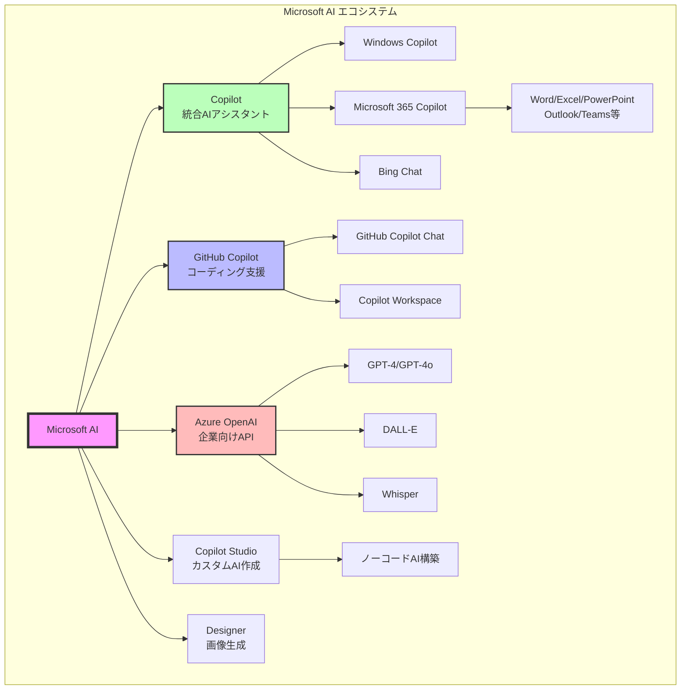

## 4.1 Microsoft Copilot（統合AIアシスタント）

**概要**: Windows、Microsoft 365、Edgeに統合されたAIアシスタント

### Copilotの展開範囲

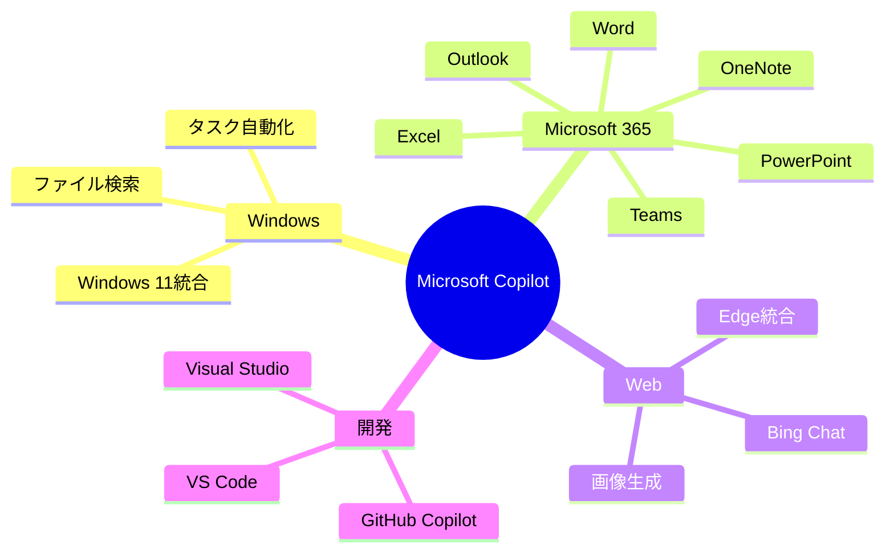

### 料金プラン

| プラン | 月額料金 | 対象 | 主な機能 |
|--------|----------|------|----------|
| **無料版** | $0 | 個人 | Bing Chat、基本機能 |
| **Copilot Pro** | $20 | 個人 | 優先アクセス、画像生成、Office統合 |
| **Microsoft 365 Copilot** | $30/ユーザー | 企業 | 全Office統合、企業データ活用 |
| **GitHub Copilot** | $10 | 開発者 | コード生成・補完 |

## 4.2 Microsoft 365 Copilot

**概要**: Office全体に統合されたAI。企業データを安全に活用

### 各アプリでの機能

#### Word Copilot
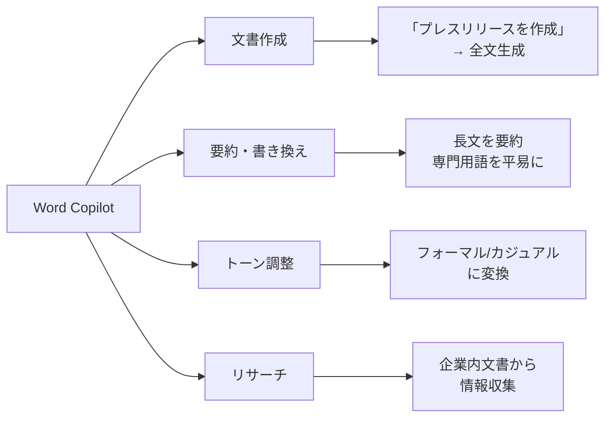

**使用例**:
```
ユーザー: "先月の営業会議の議事録を元に、
         エグゼクティブ向けサマリーを作成"

Word Copilot:
[Teams、Outlook、SharePointから関連情報を収集]
[1ページのサマリー文書を自動生成]
[グラフや重要数値を挿入]
```

#### Excel Copilot
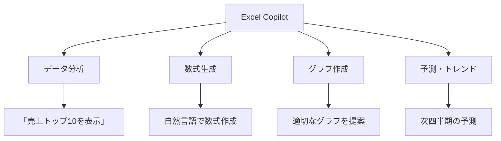

**使用例**:
```
ユーザー: "過去3年の売上データから、
         製品カテゴリ別のトレンドを分析して
         グラフで可視化"

Excel Copilot:
[ピボットテーブル作成]
[トレンド分析実行]
[複合グラフ生成]
[インサイトをコメント追加]
```

#### PowerPoint Copilot
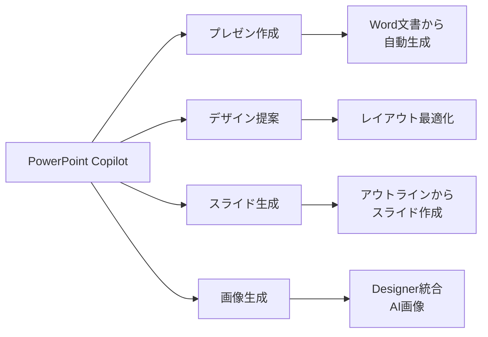

**使用例**:
```
ユーザー: "四半期レビューのプレゼンを作成。
         Excelの売上データとWord報告書を使用"

PowerPoint Copilot:
[10スライドのプレゼン生成]
- タイトルスライド
- 目次
- エグゼクティブサマリー
- データグラフ（Excelから）
- 主要インサイト（Wordから）
- アクションアイテム
```

#### Outlook Copilot
- **メール下書き**: 簡潔な指示から長文メール生成
- **要約**: 長いスレッドを要約
- **返信提案**: コンテキストに応じた返信案
- **スケジュール調整**: 会議設定の自動化

#### Teams Copilot
- **会議要約**: リアルタイムで議事録作成
- **Q&A**: 会議中の質問に回答
- **アクションアイテム**: タスクを自動抽出
- **チャット要約**: 長い会話を要約

### Microsoft 365 Copilotの特徴

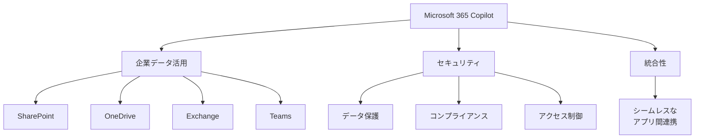

**セキュリティの特徴**:
- **データ分離**: 企業データで学習しない
- **アクセス制御**: ユーザーの権限を尊重
- **コンプライアンス**: GDPR、HIPAA等に対応

## 4.3 GitHub Copilot

**概要**: AIペアプログラマー。コードの自動補完と生成

### GitHub Copilotの進化

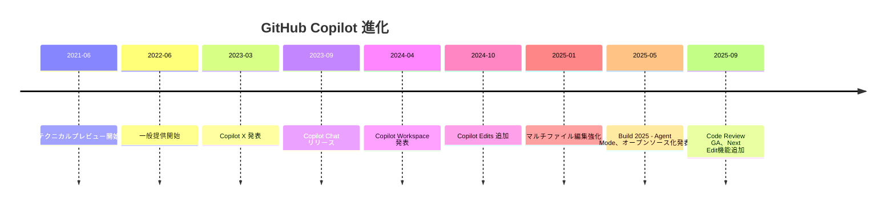

### Microsoft Build 2025 の重大発表（2025年5月）

#### VS CodeでのGitHub Copilotオープンソース化
Microsoftは、Visual Studio CodeにおけるGitHub Copilotの実装をオープンソース化すると発表。透明性とコミュニティ協力への大きな転換。

#### Agent Mode（エージェントモード）
開発者は複数の開発タスクをGitHub Copilotエージェントに割り当て可能：
- **自律的なコードリファクタリング**
- **テストカバレッジ向上**
- **不具合修正**
- **新機能実装**

現在VS CodeとVisual Studioでプレビュー中。JetBrains、Eclipse、Xcodeにも近日対応予定。

#### App Modernization（アプリモダナイゼーション）
Javaおよび.NETアプリのモダナイゼーション機能：
- **コード評価**
- **修正提案**
- **数千ファイルにわたる設定管理**

複雑で時間のかかるタスクをオフロードして、アプリを迅速に更新・アップグレード・モダナイズ。

#### PostgreSQLサポート
VS Code用PostgreSQL拡張機能（プレビュー）がGitHub Copilotと統合。開発環境で直接PostgreSQLのAIアシスタンスとデータベースコンテキストを利用可能。

### 2025年9月の機能追加

#### コードレビュー機能（GA）
C#、Go、Java、JavaScript、Markdown、Python、Ruby、TypeScriptに対応したコードレビュー機能が正式リリース。

#### Next Edit（次の編集予測）
コード変更中に次の修正を予測する機能を導入。

### 主な機能

#### 1. コード補完
```python
# コメントを書くと、コードを自動生成
# 二分探索を実装する関数

def binary_search(arr, target):
    left, right = 0, len(arr) - 1

    while left <= right:
        mid = (left + right) // 2

        if arr[mid] == target:
            return mid
        elif arr[mid] < target:
            left = mid + 1
        else:
            right = mid - 1

    return -1

# ↑ Copilotが自動生成
```

#### 2. Copilot Chat
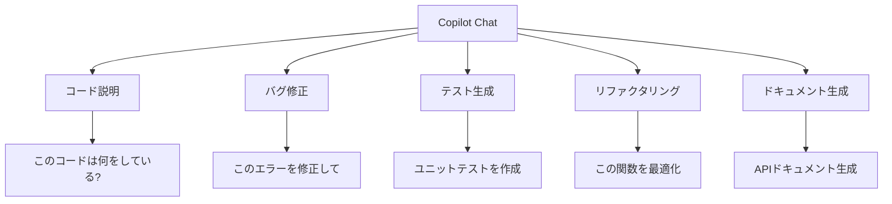

**チャット例**:
```
ユーザー: "/explain このコードの時間計算量は?"

GitHub Copilot:
"このコードの時間計算量はO(n log n)です。
なぜなら:
1. ソート処理がO(n log n)
2. その後のループがO(n)
3. 全体としてO(n log n)が支配的

改善案: ハッシュマップを使えばO(n)に削減可能です。"
```

#### 3. Copilot Workspace
**概要**: タスク全体を自動化するAIワークスペース

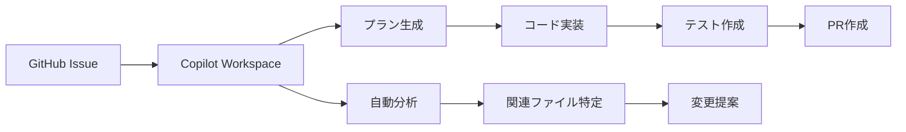

**使用例**:
```
GitHub Issue:
"ユーザー認証にOAuth2.0を追加"

Copilot Workspace:
[プロジェクト全体を分析]
[実装プラン提案]
1. auth.pyを作成
2. config.pyにOAuth設定追加
3. routes.pyにエンドポイント追加
4. テスト作成

[ユーザー承認後、全ファイルを自動生成]
[プルリクエスト作成]
```

### GitHub Copilot料金

| プラン | 月額料金 | 特徴 |
|--------|----------|------|
| **Individual** | $10/月 or $100/年 | 個人開発者向け |
| **Business** | $19/ユーザー/月 | チーム向け、管理機能 |
| **Enterprise** | $39/ユーザー/月 | 高度なセキュリティ、カスタマイズ |

**無料プラン**:
- 学生・教育者・OSSメンテナー向け

### 対応言語・IDE

**言語**: Python, JavaScript, TypeScript, Go, Ruby, Java, C++, C# など主要言語すべて

**IDE**:
- Visual Studio Code
- Visual Studio
- JetBrains全製品
- Neovim
- その他多数

## 4.4 Azure OpenAI Service

**概要**: Microsoftクラウド上でOpenAIモデルを企業向けに提供

### Azure OpenAI の特徴

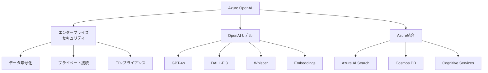

### Azure OpenAI vs OpenAI API

| 特徴 | Azure OpenAI | OpenAI API |
|------|-------------|-----------|
| **セキュリティ** | エンタープライズ級 | 標準 |
| **データ保存** | Azure内、選択可能 | OpenAI管理 |
| **SLA** | 99.9%保証 | ベストエフォート |
| **料金** | 従量課金 | 従量課金 |
| **最新モデル** | 数週間遅れ | 即座 |
| **サポート** | Azure サポート | OpenAI サポート |

### 使用例

```python
import openai

# Azure OpenAI設定
openai.api_type = "azure"
openai.api_base = "https://YOUR_RESOURCE.openai.azure.com/"
openai.api_version = "2024-02-15-preview"
openai.api_key = "YOUR_AZURE_KEY"

response = openai.ChatCompletion.create(
    engine="gpt-4o-deployment",  # Azureでのデプロイ名
    messages=[
        {"role": "system", "content": "親切なアシスタントです。"},
        {"role": "user", "content": "Azureの利点は?"}
    ]
)

print(response['choices'][0]['message']['content'])
```

### RAGシステム構築

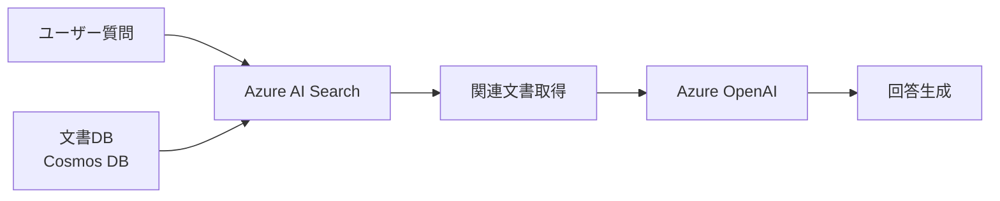

**実装パターン**:
1. 文書をEmbeddings化してAzure AI Searchに保存
2. ユーザー質問をベクトル検索
3. 検索結果をコンテキストとしてGPT-4oに渡す
4. 根拠のある回答を生成

## 4.5 Copilot Studio

**概要**: ノーコード/ローコードでカスタムCopilotを作成

### Copilot Studioの特徴

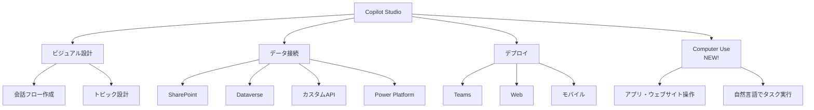

### 2025年9月の重要アップデート

#### Computer Use（コンピュータ使用機能）- パブリックプレビュー
米国ベースの環境でパブリックプレビュー開始。エージェントが自然言語でタスクを説明するだけで、アプリやウェブサイトを直接操作できる画期的な機能。

**使用例**:
```
指示: "この請求書データをERPシステムに入力して"

Copilot Studio Agent:
1. ブラウザでERPシステムを開く
2. ログイン
3. 請求書入力画面に移動
4. データを自動入力
5. 保存して確認
```

#### その他の新機能（2025年9月）
- **Microsoft 365 Copilot モバイルアプリでのエージェントサポート**: 従量課金およびCopilotチャットユーザー向け
- **WhatsAppチャンネル**: 正式リリース（全世界27億ユーザーにリーチ可能）

### 作成プロセス

1. **トピック作成**: 会話のシナリオを定義
2. **エンティティ設定**: 抽出する情報を指定
3. **アクション設定**: 外部システム連携、Computer Use設定
4. **テスト**: シミュレーターで動作確認
5. **公開**: Teams、WhatsApp、Webサイト等に配置

### 活用例

#### 社内ヘルプデスクボット
```
トピック: "経費精算について"
エンティティ: 費目、金額、日付
アクション:
  - SharePointから規程検索
  - 承認ワークフロー起動
  - 経費システムAPI連携
```

#### カスタマーサポートボット
```
トピック: "商品の返品"
エンティティ: 注文番号、理由
アクション:
  - Dynamics 365から注文情報取得
  - 返品ラベル発行
  - メール通知送信
```

## 4.6 Microsoft Designer（画像・デザイン生成）

**概要**: DALL-E 3統合のデザイン生成ツール

### Designerの機能

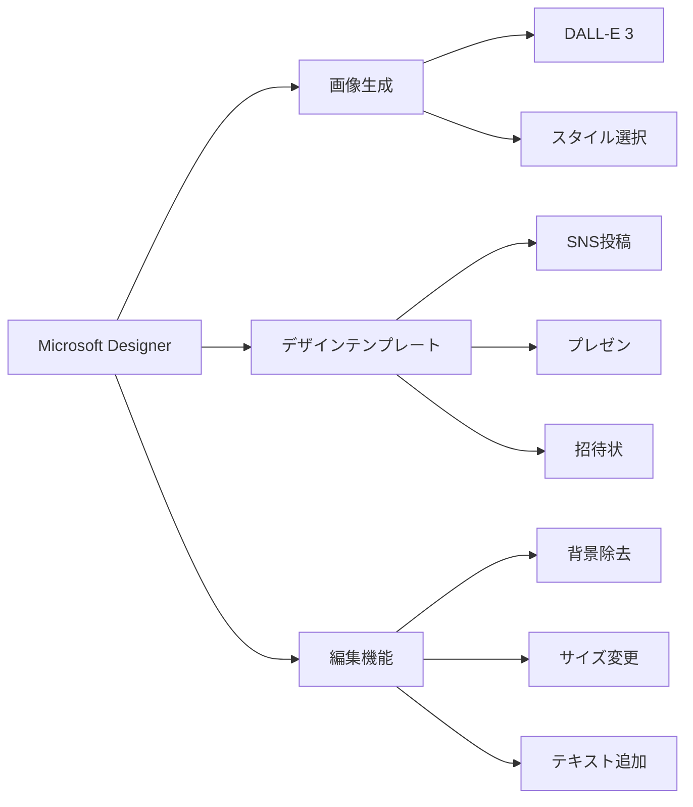

### 使用例

```
プロンプト:
"春の新商品キャンペーン用バナー、
桜のモチーフ、明るく爽やか、
Instagram用正方形"

Designer:
[複数のデザイン案を生成]
[テンプレートに画像を配置]
[テキストレイアウト提案]
→ ワンクリックでSNS投稿サイズに最適化
```

### 料金
- **無料版**: 1日15枚まで
- **Microsoft 365サブスクリプション**: 無制限（Copilot Pro含む）

## 4.7 Bing Image Creator

**概要**: DALL-E 3を使用した画像生成（Bing統合）

### 特徴
- **完全無料**: 制限なし（一部速度制限あり）
- **Bing統合**: 検索から直接画像生成
- **Edge統合**: サイドバーから利用可能

### 使い方
1. [bing.com/images/create](https://bing.com/images/create) にアクセス
2. プロンプト入力
3. 4枚の画像が生成される
4. ダウンロードまたは共有

**ブースト**: Microsoftリワードポイントで高速生成

## 4.8 Windows Copilot

**概要**: Windows 11に統合されたAIアシスタント

### 機能

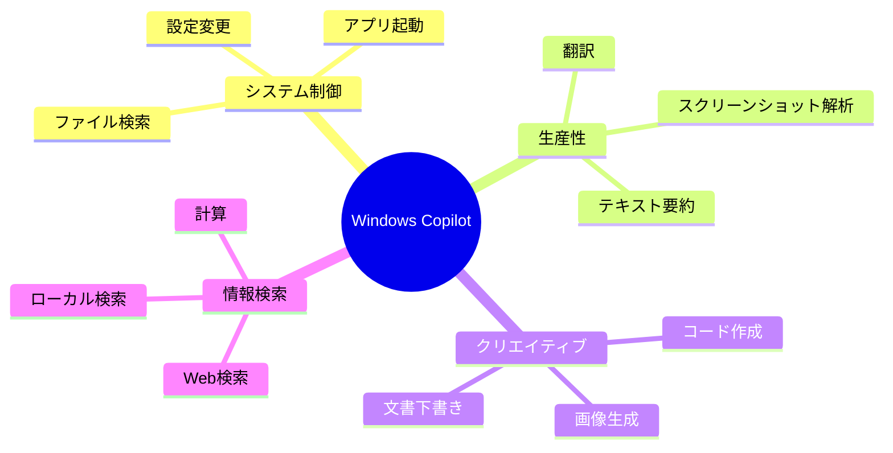

### 使用例

```
ユーザー: "このスクリーンショットのエラーを解決して"

Windows Copilot:
[画像を解析]
"これはPython ModuleNotFoundErrorです。
解決方法:
1. pip install [モジュール名]
2. 仮想環境の確認
詳しく説明しますか?"

ユーザー: "ダークモードに切り替えて"

Windows Copilot:
[設定を自動変更]
"ダークモードに変更しました。"
```

## 4.9 Microsoftの主な用途と強み

### 強みマップ

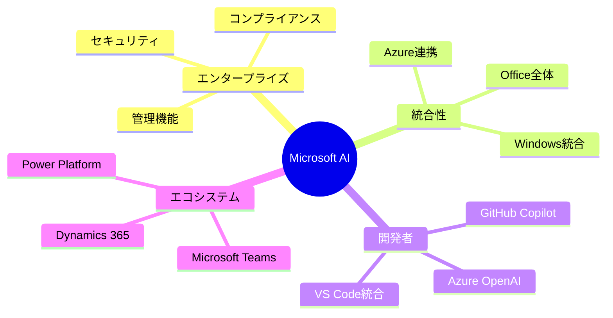

### Microsoftを選ぶべき場面

✅ **企業での利用**
- エンタープライズセキュリティ
- コンプライアンス要件
- 管理・統制機能

✅ **Microsoft製品ユーザー**
- Office 365統合
- Teams連携
- Windows環境

✅ **開発者**
- GitHub Copilot
- Visual Studio統合
- Azure開発

✅ **カスタムAI構築**
- Copilot Studio（ノーコード）
- Azure OpenAI（企業向け）

## 4.10 まとめ：Microsoftツール選択フローチャート

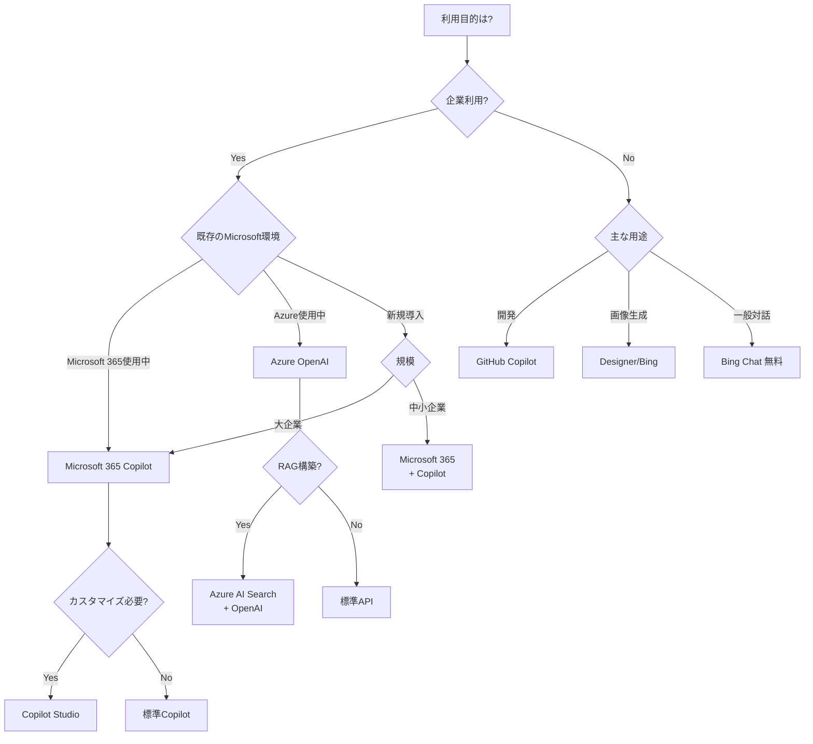

### 料金最適化のポイント

1. **既存ライセンス活用**
   - Microsoft 365ユーザーなら追加$30でフル機能
   - 学生・教育者はGitHub Copilot無料

2. **無料ツール活用**
   - Bing Chat: 完全無料
   - Bing Image Creator: 無制限
   - Windows Copilot: Windows 11に標準

3. **段階的導入**
   - 小規模: GitHub Copilot Individual ($10)
   - 中規模: Microsoft 365 Copilot
   - 大規模: Azure OpenAI + Copilot Studio

4. **適材適所**
   - Office作業: Microsoft 365 Copilot
   - コーディング: GitHub Copilot
   - カスタムAI: Azure OpenAI
   - 画像生成: Designer/Bing（無料）

### Microsoft AIの総合的な強み

**統合性**: すべての製品が連携し、シームレスな体験

**セキュリティ**: エンタープライズグレードのデータ保護

**スケーラビリティ**: 個人からグローバル企業まで対応

**サポート**: 充実したドキュメントと企業向けサポート

---

## 関連リンク
- [Microsoft Copilot](https://copilot.microsoft.com/)
- [Microsoft 365 Copilot](https://www.microsoft.com/microsoft-365/copilot)
- [GitHub Copilot](https://github.com/features/copilot)
- [Azure OpenAI Service](https://azure.microsoft.com/products/ai-services/openai-service)
- [Copilot Studio](https://www.microsoft.com/microsoft-copilot/copilot-studio)
- [Microsoft Designer](https://designer.microsoft.com/)
