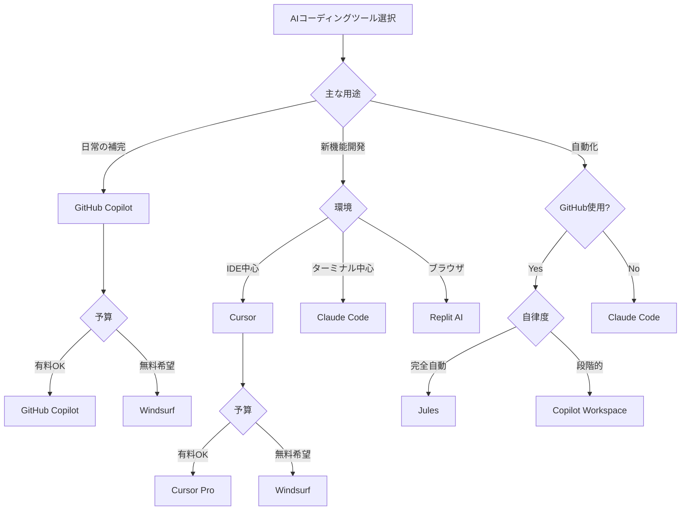
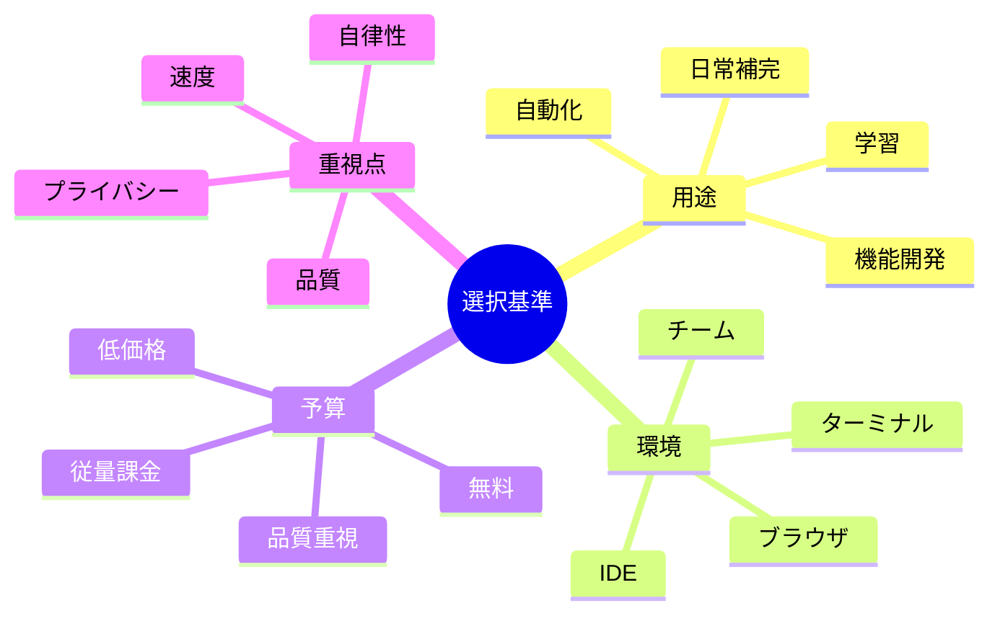

# 付録A: コーディングツール比較 - 4象限分析

AIコーディングツールは急速に進化し、多様な選択肢が登場しています。本付録では、主要なツールを4象限分析で整理し、用途に応じた最適な選択をサポートします。

## A.1 4象限マップの見方

本付録では、AIコーディングツールを2つの軸で分類します。

### 分析軸の定義

```mermaid
quadrant-chart
    title AIコーディングツール 4象限マップ
    x-axis 対話型 --> 自律型
    y-axis 汎用 --> 専門特化
    quadrant-1 専門特化・自律型
    quadrant-2 専門特化・対話型
    quadrant-3 汎用・対話型
    quadrant-4 汎用・自律型
    GitHub Copilot: [0.3, 0.4]
    Claude Code: [0.6, 0.6]
    Cursor: [0.5, 0.5]
    Windsurf: [0.7, 0.55]
    Copilot Workspace: [0.8, 0.7]
    Jules: [0.85, 0.75]
    Gemini Code Assist: [0.4, 0.45]
    Cody: [0.35, 0.4]
    Tabnine: [0.2, 0.3]
    Amazon Q Developer: [0.45, 0.5]
    Replit AI: [0.5, 0.35]
    Codex CLI: [0.65, 0.5]
```

**X軸: 対話型 ↔ 自律型**
- **対話型（左）**: ユーザーが指示を出し、AIが提案・実行
- **自律型（右）**: AIが自律的にタスクを完遂、人間は承認・調整のみ

**Y軸: 汎用 ↔ 専門特化**
- **汎用（下）**: あらゆる言語・フレームワークに対応
- **専門特化（上）**: 特定の用途・ワークフローに最適化

## A.2 各ツールの詳細比較

### 第1象限: 専門特化・自律型（右上）

#### Jules（最も自律的）
```
開発元: Anthropic
特徴: GitHub Issues から完全自動でPR作成
自律度: ★★★★★
専門度: ★★★★★（GitHub統合に特化）
```

**強み**:
- Issueの内容を読み取り、コードベース全体を理解
- 必要なファイルを特定し、実装を自動生成
- テストを自動実行して品質保証
- プルリクエストまで自動作成

**使用例**:
```
GitHub Issue: "ユーザー認証にJWT対応を追加"

Jules:
1. [関連ファイルを自動検索]
2. [実装プラン作成]
3. [コード生成・編集]
4. [テスト実行]
5. [PR自動作成]

→ 人間の介入なしで完了
```

**適した場面**:
- 明確に定義されたタスク
- GitHub中心の開発フロー
- チーム開発での自動化

**料金**: 未公開（ベータ版）

---

#### Copilot Workspace
```
開発元: GitHub (Microsoft)
特徴: タスク全体を自動化、複数ファイルの統合編集
自律度: ★★★★☆
専門度: ★★★★☆（GitHub統合）
```

**強み**:
- Issue/PRの内容から実装プランを提案
- 複数ファイルを同時編集
- 段階的な実装プロセス

**使用例**:
```
GitHub Issue: "パフォーマンス改善"

Copilot Workspace:
[プラン]
1. データベースクエリ最適化
2. キャッシュ層追加
3. 非同期処理化

[ユーザーが承認]
[全ファイルを自動編集]
[テスト実施]
```

**適した場面**:
- 中〜大規模なタスク
- 複数ファイルにまたがる変更
- GitHub使用チーム

**料金**: GitHub Copilot Business/Enterprise に含まれる

---

### 第2象限: 専門特化・対話型（左上）

この象限には現在、主要ツールが少ないですが、将来的に特定ドメイン（例: データサイエンス専用、Web開発専用など）のツールが登場する可能性があります。

---

### 第3象限: 汎用・対話型（左下）

#### GitHub Copilot
```
開発元: GitHub (Microsoft)
特徴: コード補完のデファクトスタンダード
自律度: ★★☆☆☆
専門度: ★★☆☆☆（汎用）
```

**強み**:
- リアルタイムコード補完
- 幅広い言語対応
- IDE深く統合

**使用例**:
```python
# コメント書くだけでコード生成
# ユーザー情報をAPIから取得する関数

def fetch_user(user_id):
    # ↓ Copilotが自動補完
    response = requests.get(f"https://api.example.com/users/{user_id}")
    return response.json()
```

**適した場面**:
- 日常的なコーディング
- コード補完・スニペット生成
- 多言語開発

**料金**: $10/月（個人）、$19/月（ビジネス）

---

#### Cody（Sourcegraph）
```
開発元: Sourcegraph
特徴: コードベース全体を理解、オープンソース重視
自律度: ★★☆☆☆
専門度: ★★☆☆☆
```

**強み**:
- 大規模コードベースの理解
- コンテキスト検索
- 複数のLLMに対応（Claude, GPT-4等）

**適した場面**:
- 大規模プロジェクト
- レガシーコード理解
- モノレポ環境

**料金**: 無料版あり、Pro $9/月、Enterprise カスタム

---

#### Tabnine
```
開発元: Tabnine
特徴: プライバシー重視、ローカル実行可能
自律度: ★☆☆☆☆
専門度: ★★☆☆☆
```

**強み**:
- オフライン動作
- 企業データの外部送信なし
- カスタムモデル学習

**適した場面**:
- セキュリティ重視環境
- エアギャップ環境
- 独自コードスタイル学習

**料金**: 無料版あり、Pro $12/月、Enterprise カスタム

---

#### Gemini Code Assist
```
開発元: Google
特徴: Google Cloud統合、超長コンテキスト
自律度: ★★☆☆☆
専門度: ★★☆☆☆
```

**強み**:
- 100万トークンのコンテキスト
- Google Cloud連携
- マルチファイル理解

**適した場面**:
- Google Cloud利用者
- 大規模コードベース
- コード理解・リファクタリング

**料金**: $19/月

---

### 第4象限: 汎用・自律型（右下）

#### Claude Code
```
開発元: Anthropic
特徴: ターミナルから対話、プロジェクト全体を理解
自律度: ★★★★☆
専門度: ★★★☆☆
```

**強み**:
- プロジェクト全体をコンテキスト理解
- ファイル編集、コマンド実行を自律的に
- Git操作も自然言語で
- 高品質なコード生成

**使用例**:
```bash
$ claude-code

> このプロジェクトにユーザー認証を追加して

[Claude Code]
プロジェクトを分析しました。以下の変更を行います:
1. src/auth.py を作成
2. src/app.py にルート追加
3. requirements.txt を更新
4. tests/test_auth.py を作成

実行しますか? (y/n): y

[ファイル自動生成]
[テスト実行]
[Git コミット]

完了しました。
```

**適した場面**:
- 新機能追加
- プロジェクト全体の理解が必要
- ターミナル中心のワークフロー

**料金**: Claude API使用（従量課金）

---

#### Cursor
```
開発元: Cursor
特徴: VS Code ベースの AI-first エディタ
自律度: ★★★☆☆
専門度: ★★★☆☆
```

**強み**:
- エディタとAIの深い統合
- マルチファイル編集
- コードベース理解
- Ctrl+K でインライン編集

**使用例**:
```
Ctrl+K: "この関数をTypeScriptに変換"
→ その場でコード変換

Cmd+L: "このバグを修正して"
→ チャットで原因分析 → 修正提案
```

**適した場面**:
- IDE統合を重視
- インタラクティブな編集
- ペアプログラミング的な使い方

**料金**: 無料版あり、Pro $20/月

---

#### Windsurf
```
開発元: Codeium
特徴: 「Flow」モードで自律的に作業
自律度: ★★★★☆
専門度: ★★★☆☆
```

**強み**:
- Flowモード: AIが提案 → 実行を連続自動化
- Cascade: 複数ファイル同時編集
- 無料で多機能

**使用例**:
```
"Reactアプリを作成"

[Windsurf Flow モード]
1. プロジェクト構造作成
2. 依存関係インストール
3. コンポーネント生成
4. スタイリング
5. デプロイ設定

→ 各ステップで確認求め、承認後自動実行
```

**適した場面**:
- 新規プロジェクト立ち上げ
- 反復的なタスク
- コスト重視（無料版が強力）

**料金**: 無料版が強力、Pro $10/月

---

#### Codex CLI
```
開発元: コミュニティ／OpenAI APIベース
特徴: ターミナルからGPT-4にアクセス
自律度: ★★★☆☆
専門度: ★★☆☆☆
```

**強み**:
- シンプルなCLIツール
- スクリプト生成に特化
- パイプライン統合しやすい

**適した場面**:
- シェルスクリプト生成
- 自動化パイプライン
- 軽量なCLIツール

**料金**: OpenAI API料金のみ

---

#### Amazon Q Developer
```
開発元: Amazon
特徴: AWS統合、セキュリティスキャン
自律度: ★★★☆☆
専門度: ★★★☆☆（AWS特化面あり）
```

**強み**:
- AWS サービス知識
- セキュリティ脆弱性検出
- コード変換（Java 8→17等）

**適した場面**:
- AWS環境開発
- レガシーコード移行
- セキュリティ重視

**料金**: 無料版あり、Pro $19/月

---

#### Replit AI
```
開発元: Replit
特徴: ブラウザ完結、即座に実行環境
自律度: ★★★☆☆
専門度: ★★☆☆☆
```

**強み**:
- ゼロセットアップ
- チーム共同編集
- 即座にデプロイ

**適した場面**:
- プロトタイピング
- 学習・教育
- チーム共同開発

**料金**: 無料版あり、Pro $20/月

---

## A.3 詳細比較表

### 機能比較

| ツール | コード補完 | チャット | 自律実行 | マルチファイル | テスト自動化 | Git統合 |
|--------|----------|---------|---------|------------|------------|---------|
| **GitHub Copilot** | ⭐⭐⭐⭐⭐ | ⭐⭐⭐ | ⭐ | ⭐⭐ | ❌ | ⭐ |
| **Claude Code** | ⭐⭐ | ⭐⭐⭐⭐⭐ | ⭐⭐⭐⭐ | ⭐⭐⭐⭐⭐ | ⭐⭐⭐⭐ | ⭐⭐⭐⭐ |
| **Cursor** | ⭐⭐⭐⭐ | ⭐⭐⭐⭐ | ⭐⭐⭐ | ⭐⭐⭐⭐ | ⭐ | ⭐⭐ |
| **Windsurf** | ⭐⭐⭐⭐ | ⭐⭐⭐⭐ | ⭐⭐⭐⭐ | ⭐⭐⭐⭐ | ⭐⭐ | ⭐⭐ |
| **Copilot Workspace** | ❌ | ⭐⭐⭐⭐ | ⭐⭐⭐⭐ | ⭐⭐⭐⭐⭐ | ⭐⭐⭐⭐ | ⭐⭐⭐⭐⭐ |
| **Jules** | ❌ | ⭐⭐⭐ | ⭐⭐⭐⭐⭐ | ⭐⭐⭐⭐⭐ | ⭐⭐⭐⭐⭐ | ⭐⭐⭐⭐⭐ |
| **Gemini Code Assist** | ⭐⭐⭐ | ⭐⭐⭐⭐ | ⭐⭐ | ⭐⭐⭐⭐⭐ | ⭐ | ⭐ |
| **Cody** | ⭐⭐⭐ | ⭐⭐⭐⭐ | ⭐⭐ | ⭐⭐⭐⭐ | ⭐ | ⭐ |
| **Tabnine** | ⭐⭐⭐⭐ | ⭐⭐ | ⭐ | ⭐⭐ | ❌ | ❌ |
| **Amazon Q** | ⭐⭐⭐ | ⭐⭐⭐ | ⭐⭐⭐ | ⭐⭐⭐ | ⭐⭐⭐ | ⭐⭐ |
| **Replit AI** | ⭐⭐⭐ | ⭐⭐⭐ | ⭐⭐⭐ | ⭐⭐⭐ | ⭐⭐ | ⭐⭐⭐ |

### 価格比較（月額）

| ツール | 無料版 | 個人プラン | ビジネスプラン | 特記事項 |
|--------|--------|-----------|--------------|---------|
| **GitHub Copilot** | ❌ | $10 | $19/ユーザー | 学生・OSS無料 |
| **Claude Code** | ❌ | 従量課金 | 従量課金 | API使用料のみ |
| **Cursor** | ✅ | $20 | $40/ユーザー | 無料版は制限あり |
| **Windsurf** | ✅（強力） | $10 | 未定 | 無料版でも多機能 |
| **Copilot Workspace** | ❌ | - | $19〜39 | Copilotライセンス必要 |
| **Jules** | ❌ | 未定 | 未定 | ベータ版 |
| **Gemini Code Assist** | ❌ | $19 | カスタム | GCP統合 |
| **Cody** | ✅ | $9 | カスタム | 無料版あり |
| **Tabnine** | ✅ | $12 | カスタム | オフライン可 |
| **Amazon Q** | ✅ | $19 | カスタム | AWS統合 |
| **Replit AI** | ✅ | $20 | カスタム | 実行環境込み |

## A.4 用途別おすすめツール

### シーン1: 日々のコーディング
```
目的: コード補完、スニペット生成
推奨:
1. GitHub Copilot（定番、安定）
2. Cursor（IDE統合、インタラクティブ）
3. Tabnine（プライバシー重視）
```

### シーン2: 新機能の実装
```
目的: 複数ファイル編集、プロジェクト全体理解
推奨:
1. Claude Code（高品質、自律的）
2. Cursor（エディタ統合）
3. Windsurf（無料で強力）
```

### シーン3: Issue → PR 自動化
```
目的: GitHub Issueから自動実装
推奨:
1. Jules（完全自動）
2. Copilot Workspace（段階的自動化）
```

### シーン4: 大規模リファクタリング
```
目的: コードベース全体の理解、複雑な変更
推奨:
1. Gemini Code Assist（超長コンテキスト）
2. Cody（大規模コードベース特化）
3. Claude Code（高品質な変更）
```

### シーン5: プロトタイピング
```
目的: 素早くアイデアを形に
推奨:
1. Replit AI（即座に実行環境）
2. Cursor（高速な編集サイクル）
3. Windsurf（自動化が強力）
```

### シーン6: セキュリティ重視
```
目的: 企業環境、データ保護
推奨:
1. Tabnine（ローカル実行）
2. Amazon Q（AWS統合、セキュリティスキャン）
3. GitHub Copilot Business（エンタープライズ管理）
```

### シーン7: AWS開発
```
目的: AWS環境でのアプリ開発
推奨:
1. Amazon Q Developer（AWS知識豊富）
2. Cursor（汎用的）
```

### シーン8: Google Cloud開発
```
目的: GCP環境でのアプリ開発
推奨:
1. Gemini Code Assist（GCP統合）
2. Claude Code（汎用的、高品質）
```

## A.5 ツール選択のポイント

### 選択フローチャート



### 重視する観点別

#### 1. コスト重視
- **無料で強力**: Windsurf
- **低価格**: Cody ($9), GitHub Copilot ($10)
- **従量課金**: Claude Code

#### 2. 品質重視
- **最高品質**: Claude Code
- **バランス**: Cursor, GitHub Copilot

#### 3. 自律性重視
- **最も自律**: Jules
- **高い自律性**: Copilot Workspace, Windsurf, Claude Code
- **対話的**: GitHub Copilot, Cursor

#### 4. エコシステム重視
- **GitHub**: Jules, Copilot Workspace, GitHub Copilot
- **AWS**: Amazon Q
- **GCP**: Gemini Code Assist
- **汎用**: Claude Code, Cursor, Windsurf

#### 5. プライバシー重視
- **ローカル実行**: Tabnine
- **データ保護**: Tabnine, Amazon Q, Copilot Business

## A.6 複数ツールの併用戦略

多くの開発者は複数のツールを組み合わせて使用しています。

### 推奨組み合わせ例

#### パターン1: バランス型
```
日常: GitHub Copilot（補完）
複雑タスク: Claude Code（自律実行）
コスト: 月$10 + 従量課金
```

#### パターン2: 無料最大化
```
日常: Windsurf（無料版）
自動化: 自作スクリプト + OpenAI API
コスト: APIの従量課金のみ
```

#### パターン3: エンタープライズ
```
チーム: GitHub Copilot Business
個人タスク: Cursor または Claude Code
自動化: Copilot Workspace / Jules
コスト: $19/ユーザー + 追加ツール
```

#### パターン4: 最高品質追求
```
すべてのタスク: Claude Code
補完のみ: Cursor（エディタ統合）
コスト: Claude API従量 + Cursor $20
```

## A.7 まとめ



### 最終推奨（2025年10月時点）

**万能選択**: Claude Code（高品質、自律的、柔軟）

**コスパ最強**: Windsurf（無料で強力、自律性高い）

**定番安定**: GitHub Copilot（広く使われ、安定）

**完全自動**: Jules（Issue → PR完全自動化）

**IDE統合**: Cursor（エディタとAIの融合）

**エンタープライズ**: GitHub Copilot Business + Copilot Workspace

---

## 関連リンク
- [GitHub Copilot](https://github.com/features/copilot)
- [Claude Code](https://github.com/anthropics/claude-code)
- [Cursor](https://cursor.sh/)
- [Windsurf](https://codeium.com/windsurf)
- [Copilot Workspace](https://githubnext.com/projects/copilot-workspace)
- [Gemini Code Assist](https://cloud.google.com/products/gemini/code-assist)
- [Cody](https://sourcegraph.com/cody)
- [Amazon Q Developer](https://aws.amazon.com/q/developer/)
- [Replit](https://replit.com/)
