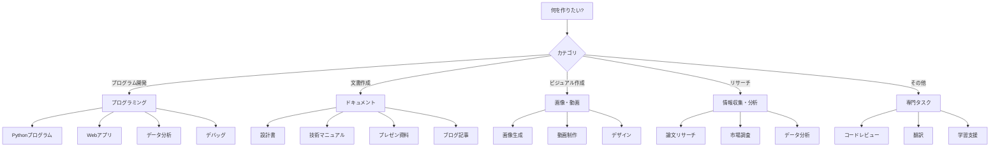
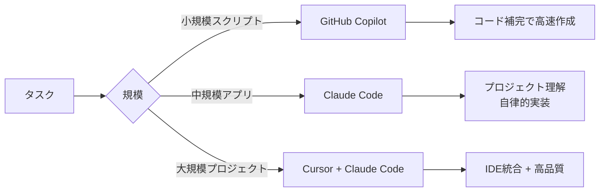
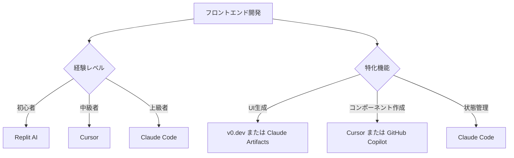
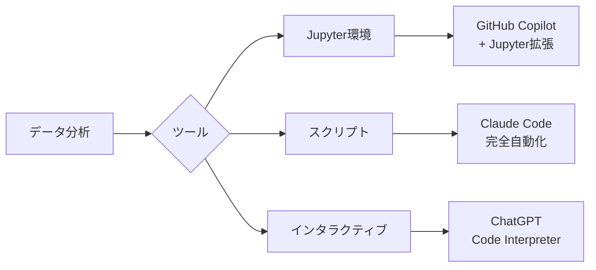
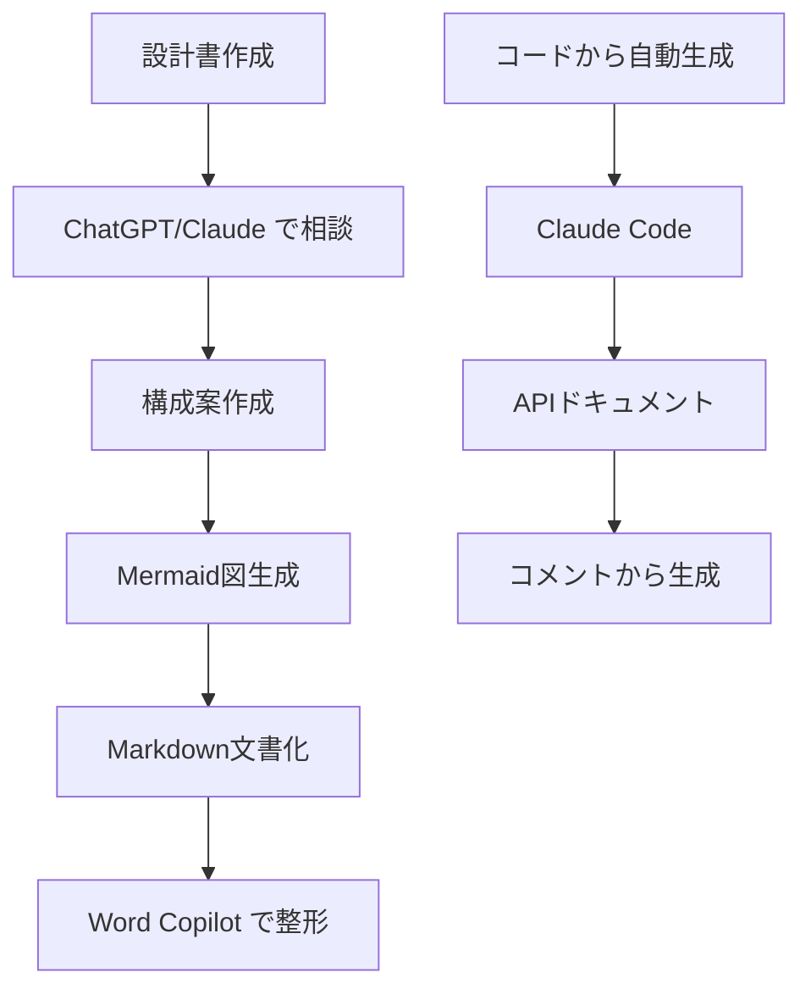
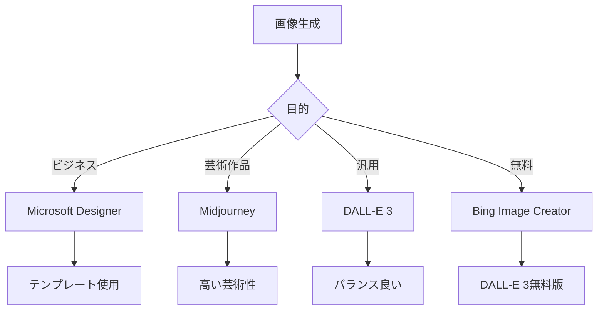

# 付録B: 用途別ツール選択ガイド

「Pythonでプログラムを作りたい」「設計書を作成したい」「マニュアルを作成したい」「プレゼン資料を作りたい」など、具体的な用途に応じて最適なAIツールを選択できるように、本付録では実践的なガイドを提供します。

## B.1 用途別フローチャート（メイン）



## B.2 ユースケース別推奨ツール

### プログラミング

#### B.2.1 Pythonプログラム開発

**シナリオ**: データ処理スクリプトを作成したい



**推奨ツール比較**:

| ツール | 適性 | 理由 | 料金 |
|--------|------|------|------|
| **GitHub Copilot** | ⭐⭐⭐⭐ | リアルタイム補完、Python強い | $10/月 |
| **Claude Code** | ⭐⭐⭐⭐⭐ | 高品質、テスト自動作成、エラー処理完璧 | 従量課金 |
| **Cursor** | ⭐⭐⭐⭐ | IDE統合、インラインで編集 | $20/月 |
| **Replit AI** | ⭐⭐⭐ | ブラウザで即実行、学習に最適 | 無料〜 |
| **ChatGPT Code Interpreter** | ⭐⭐⭐ | データ分析スクリプトに強い | $20/月 |

**実践ワークフロー例**:
```
1. GitHub Copilot で基本構造を高速作成
2. Claude Code で品質向上・テスト追加
3. Cursor で細かい調整
```

**サンプルタスク**:
```
タスク: CSVファイルを読み込み、データをグラフ化するスクリプト

推奨: Claude Code
理由:
- ファイルI/O、データ処理、可視化を統合的に実装
- エラーハンドリングも完璧
- テストコードも自動生成
```

---

#### B.2.2 フロントエンド開発（React/Vue等）

**シナリオ**: Webアプリケーションのフロントエンドを構築



**推奨ツール**:

| ツール | 適性 | 強み |
|--------|------|------|
| **Cursor** | ⭐⭐⭐⭐⭐ | JSX/TSXインライン編集、即座にプレビュー |
| **Claude Artifacts** | ⭐⭐⭐⭐ | インタラクティブUIをブラウザで即確認 |
| **v0.dev (Vercel)** | ⭐⭐⭐⭐ | デザインからコード生成、Shadcn/ui統合 |
| **Replit AI** | ⭐⭐⭐ | ブラウザで完結、即デプロイ |
| **GitHub Copilot** | ⭐⭐⭐⭐ | コンポーネント補完に優れる |

**ベストプラクティス**:
```
デザイン → v0.dev（UIコード生成）
↓
実装 → Cursor（エディタで編集）
↓
ロジック追加 → Claude Code（複雑な状態管理）
↓
テスト → ChatGPT（テストケース生成）
```

---

#### B.2.3 バックエンド開発（API、データベース）

**推奨ツール**:

| タスク | ツール | 理由 |
|--------|--------|------|
| **REST API作成** | Claude Code | エンドポイント設計から実装まで一貫 |
| **GraphQL API** | Cursor | スキーマ定義をインラインで編集しやすい |
| **データベース設計** | ChatGPT → Claude Code | ChatGPTで設計相談、Claude Codeで実装 |
| **認証実装** | Claude Code | セキュリティ考慮した実装 |
| **AWS Lambda** | Amazon Q Developer | AWS知識が豊富 |
| **Google Cloud Functions** | Gemini Code Assist | GCP統合 |

**実例**: Node.js + Express + PostgreSQL
```
1. ChatGPT: API設計相談、エンドポイント一覧作成
2. Claude Code: 実装（routes, controllers, models）
3. GitHub Copilot: SQLクエリ補完
4. Amazon Q: デプロイ設定（AWS使用時）
```

---

#### B.2.4 データ分析・機械学習

**シナリオ**: データ分析と可視化



**推奨ツール**:

| 用途 | ツール | 理由 |
|------|--------|------|
| **探索的データ分析** | ChatGPT Code Interpreter | データをアップロードするだけで分析 |
| **可視化** | ChatGPT / NotebookLM | グラフ自動生成 |
| **機械学習モデル** | Claude Code | 高品質な実装、ハイパーパラメータ調整 |
| **Jupyter Notebook** | GitHub Copilot | セル補完 |
| **統計分析** | ChatGPT o1 | 高度な数学的推論 |

**ワークフロー例**:
```
1. データ理解: ChatGPT にCSVアップロード
   → 要約統計、分布確認、欠損値チェック

2. 前処理: Claude Code でスクリプト作成
   → 再利用可能なパイプライン

3. 可視化: ChatGPT Code Interpreter
   → 様々な角度からグラフ作成

4. モデリング: Claude Code
   → scikit-learn / PyTorch コード生成
```

---

### ドキュメント作成

#### B.2.5 設計書作成

**シナリオ**: システム設計書を作成したい

**推奨ツール**:

| 設計書種類 | ツール | 理由 |
|-----------|--------|------|
| **要件定義書** | ChatGPT / Claude | 構造化された文書生成に強い |
| **アーキテクチャ設計** | Claude | 複雑な論理構造の整理が得意 |
| **API仕様書** | Claude Code | コードから自動生成、OpenAPI対応 |
| **データベース設計書** | ChatGPT + Mermaid | ER図自動生成 |
| **UML図** | Claude / ChatGPT | PlantUML, Mermaid生成 |

**ベストプラクティス**:


**実例**: APIドキュメント自動生成
```
ツール: Claude Code

$ claude-code

> このプロジェクトのAPI仕様書をOpenAPI形式で作成して

[Claude Code]
- コード解析
- エンドポイント抽出
- スキーマ定義
- openapi.yaml 自動生成
```

---

#### B.2.6 技術文書・マニュアル作成

**推奨ツール**:

| マニュアル種類 | ツール | 理由 |
|--------------|--------|------|
| **インストールガイド** | Claude / ChatGPT | 手順を明確に |
| **ユーザーマニュアル** | ChatGPT + DALL-E | 説明文 + スクリーンショット |
| **API リファレンス** | Claude Code | コードから自動生成 |
| **チュートリアル** | ChatGPT | 段階的な説明が得意 |
| **FAQ** | Claude / Gemini | 検索機能活用 |
| **多言語マニュアル** | ChatGPT | 翻訳品質が高い |

**ワークフロー例**:
```
1. アウトライン作成: ChatGPT
   "○○の使い方マニュアルの目次を作成"

2. 本文執筆: Claude
   各章を詳細に執筆（長文理解に優れる）

3. スクリーンショット: 手動 or DALL-E
   必要な画像を挿入

4. 最終調整: Word Copilot / Google Docs Gemini
   フォーマット統一、読みやすさ向上

5. 翻訳: ChatGPT
   英語、中国語等に展開
```

---

#### B.2.7 プレゼン資料作成

**シナリオ**: ビジネスプレゼンテーション作成

**推奨ツール**:

| 用途 | ツール | 強み |
|------|--------|------|
| **アウトライン作成** | ChatGPT / Claude | ストーリー構成 |
| **スライド自動生成** | PowerPoint Copilot | Wordから自動変換 |
| **デザイン作成** | Google Slides Gemini / Canva | テンプレート豊富 |
| **画像生成** | DALL-E / Designer | アイキャッチ、図解 |
| **データ可視化** | Excel Copilot | グラフ自動生成 |
| **動画プレゼン** | Google Vids | AIナレーション付き動画 |

**完全自動化ワークフロー**:


**実例**:
```
テーマ: "AI活用による業務効率化の提案"

1. ChatGPT:
   "AI活用提案のプレゼン構成を10スライドで"
   → アウトライン生成

2. Word Copilot:
   "このアウトラインから詳細文書を作成"
   → 3ページの提案書

3. PowerPoint Copilot:
   "この文書からプレゼンを作成"
   → 10スライド自動生成

4. Designer:
   "AI技術を象徴する画像、ビジネスシーン"
   → タイトルスライド用画像

完成！
```

---

#### B.2.8 ブログ記事・コンテンツ制作

**推奨ツール**:

| コンテンツ種類 | ツール | 理由 |
|--------------|--------|------|
| **技術ブログ** | Claude | 深い技術理解、長文執筆 |
| **SEO記事** | ChatGPT | キーワード最適化 |
| **SNS投稿** | Gemini | 検索統合、最新情報 |
| **アイキャッチ** | DALL-E / Designer | 高品質画像 |
| **動画スクリプト** | ChatGPT | 会話調の文章 |
| **プレスリリース** | Claude | フォーマル文書 |

**ベストプラクティス**:
```
1. リサーチ: Gemini（最新情報検索）
2. アウトライン: ChatGPT
3. 執筆: Claude（長文、技術的内容）
4. SEO最適化: ChatGPT
5. 画像生成: DALL-E
6. 最終チェック: Claude
```

---

### 画像・動画・デザイン

#### B.2.9 画像生成・編集

**ユースケース別推奨**:

| 用途 | ツール | 理由 | 料金 |
|------|--------|------|------|
| **写実的画像** | DALL-E 3 | フォトリアリスティック | $20/月 |
| **アート・イラスト** | Midjourney | 芸術性が高い | $10〜/月 |
| **ビジネス画像** | Microsoft Designer | テンプレート豊富 | 無料〜 |
| **SNS投稿画像** | Canva + AI | サイズ最適化 | 無料〜 |
| **プレゼン用図解** | Claude → Mermaid / DALL-E | 図解 + 装飾 | - |
| **ロゴ作成** | DALL-E / Designer | 複数案生成 | - |

**画像生成フローチャート**:


**プロンプト作成支援**:
```
良いプロンプトが思いつかない場合:

1. ChatGPT に相談:
   "ビジネスプレゼン用の、AI技術を表現する画像のプロンプトを考えて"

2. ChatGPT が詳細プロンプト生成:
   "A modern, professional illustration of artificial intelligence...
    futuristic, blue and white color scheme, minimalist..."

3. このプロンプトをDALL-E / Midjourney / Designerに入力
```

---

#### B.2.10 動画制作

**推奨ツール**:

| 動画種類 | ツール | 特徴 |
|---------|--------|------|
| **プレゼン動画** | Google Vids | AIナレーション、自動編集 |
| **解説動画** | Descript | テキストから音声、編集 |
| **ショート動画** | Runway ML | AI動画生成 |
| **スクリーンキャスト** | Loom + ChatGPT | 録画 + 台本作成 |
| **アニメーション** | Runway / Pika | テキスト→動画 |

**ワークフロー例**: 製品紹介動画
```
1. 台本作成: ChatGPT
   "新製品○○の30秒紹介動画の台本"

2. 画像生成: DALL-E
   各シーンのビジュアル作成

3. 動画生成: Google Vids
   - 画像インポート
   - AIナレーション追加
   - BGM自動選択
   - トランジション

4. 完成
```

---

### リサーチ・情報収集

#### B.2.11 論文リサーチ

**推奨ツール**:

| タスク | ツール | 理由 |
|--------|--------|------|
| **論文要約** | NotebookLM | 音声要約、複数論文統合 |
| **文献検索** | Gemini | Google Scholar統合 |
| **引用管理** | ChatGPT | BibTeX生成 |
| **論文執筆** | Claude | 長文、論理構成 |
| **図表作成** | ChatGPT Code Interpreter | データから自動生成 |

**NotebookLM活用例**:
```
1. 論文PDF 10本をアップロード

2. NotebookLM:
   - 全論文を横断的に理解
   - 共通テーマを抽出
   - 矛盾点を指摘

3. 音声要約生成:
   2人のホストが10分間で論文を議論
   → 通勤中に聞いて理解

4. Q&A:
   "これらの論文でのAI倫理の扱いは?"
   → 各論文から該当箇所を引用して回答
```

---

#### B.2.12 市場調査・ビジネスリサーチ

**推奨ツール**:

| タスク | ツール | 強み |
|--------|--------|------|
| **最新トレンド** | Gemini / ChatGPT Web検索 | リアルタイム情報 |
| **競合分析** | Claude | 複雑な分析 |
| **データ分析** | ChatGPT Code Interpreter | 統計処理 |
| **レポート作成** | Word Copilot | 文書整形 |
| **プレゼン作成** | PowerPoint Copilot | スライド自動生成 |

**完全ワークフロー**:
```
1. 情報収集: Gemini
   "2025年のAI市場トレンドを教えて"
   → 最新記事から情報収集

2. データ分析: ChatGPT
   市場データCSVをアップロード
   → グラフ・統計分析

3. 深い分析: Claude
   "このデータから戦略提案を作成"
   → 論理的な分析レポート

4. プレゼン化: PowerPoint Copilot
   "このレポートからプレゼンを作成"
   → 役員向けスライド完成
```

---

### その他の専門タスク

#### B.2.13 コードレビュー

**推奨ツール**:

| レビュー観点 | ツール | 理由 |
|------------|--------|------|
| **全体品質** | Claude Code | 高品質な指摘 |
| **セキュリティ** | Amazon Q | 脆弱性検出 |
| **パフォーマンス** | ChatGPT o1 | 計算量分析 |
| **ベストプラクティス** | GitHub Copilot | 一般的なパターン提案 |

**実践例**:
```
1. Claude Code でコード読み込み:
   "このコードをレビューして"

   → 指摘:
   - エラーハンドリング不足
   - 変数名が不明瞭
   - パフォーマンス改善案
   - テストケース不足

2. Amazon Q でセキュリティチェック:
   → SQLインジェクション脆弱性検出

3. 修正: Claude Code
   "指摘に従って修正して"
   → 自動修正
```

---

#### B.2.14 翻訳

**推奨ツール**:

| 翻訳種類 | ツール | 理由 |
|---------|--------|------|
| **技術文書** | ChatGPT | 技術用語正確 |
| **ビジネス文書** | Claude | フォーマル文体 |
| **カジュアル** | ChatGPT | 自然な表現 |
| **大量翻訳** | Claude API | バッチ処理 |
| **ローカライズ** | ChatGPT | 文化的配慮 |

**高品質翻訳ワークフロー**:
```
1. 初回翻訳: ChatGPT
   日本語 → 英語

2. レビュー: Claude
   "この翻訳の品質をチェック、改善案を提示"

3. ネイティブチェック: ChatGPT
   "ネイティブスピーカーの視点で自然な表現に"

4. 最終確認
```

---

#### B.2.15 学習支援

**推奨ツール**:

| 学習内容 | ツール | 理由 |
|---------|--------|------|
| **プログラミング学習** | GitHub Copilot | コード補完で学習 |
| **概念理解** | Claude | 丁寧な説明 |
| **問題演習** | ChatGPT | 練習問題生成 |
| **資格試験対策** | Claude / ChatGPT | 過去問解説 |
| **言語学習** | ChatGPT Voice | 会話練習 |

**プログラミング学習例**:
```
初心者: Replit AI
- ブラウザで即実行
- ステップバイステップ指導

中級者: GitHub Copilot + ChatGPT
- Copilot: コード書きながら学ぶ
- ChatGPT: 概念を質問

上級者: Claude Code
- 実践的なプロジェクトで学習
- ベストプラクティス習得
```

---

## B.3 複数ツールの連携パターン

### パターン1: フルスタック開発
```
設計: ChatGPT（アーキテクチャ相談）
↓
フロントエンド: Cursor（React開発）
↓
バックエンド: Claude Code（API実装）
↓
インフラ: Amazon Q（AWS設定）
↓
テスト: GitHub Copilot（テストコード補完）
↓
デプロイ: Claude Code（自動化）
```

### パターン2: コンテンツマーケティング
```
市場調査: Gemini（最新トレンド検索）
↓
記事執筆: Claude（長文ブログ）
↓
SEO最適化: ChatGPT
↓
画像生成: DALL-E
↓
SNS投稿: Designer（サイズ最適化）
↓
分析: Excel Copilot（効果測定）
```

### パターン3: 研究開発
```
文献調査: NotebookLM（論文要約）
↓
実験設計: Claude（計画立案）
↓
データ分析: ChatGPT Code Interpreter
↓
論文執筆: Claude（長文、論理構成）
↓
図表作成: ChatGPT / Mermaid
↓
プレゼン: PowerPoint Copilot
```

### パターン4: エンタープライズアプリ開発
```
要件定義: Microsoft 365 Copilot（Teams会議要約）
↓
設計書: Word Copilot
↓
開発: GitHub Copilot + Copilot Workspace
↓
レビュー: Claude Code
↓
セキュリティ: Amazon Q
↓
デプロイ: Azure OpenAI（自動化スクリプト）
```

---

## B.4 コスト比較表

### 用途別の月額コスト試算

| 用途 | ツール組み合わせ | 月額コスト | コスパ |
|------|----------------|----------|--------|
| **プログラミング（個人）** | Windsurf（無料）+ Claude API | $0〜30 | ⭐⭐⭐⭐⭐ |
| **プログラミング（個人）** | GitHub Copilot + Cursor | $30 | ⭐⭐⭐⭐ |
| **プログラミング（プロ）** | Claude Code + Cursor Pro | $20 + 従量 | ⭐⭐⭐⭐⭐ |
| **コンテンツ制作** | ChatGPT Plus | $20 | ⭐⭐⭐⭐ |
| **コンテンツ制作（プロ）** | ChatGPT + Claude + DALL-E | $40 + 従量 | ⭐⭐⭐⭐ |
| **ビジネス全般** | Microsoft 365 Copilot | $30/user | ⭐⭐⭐⭐ |
| **リサーチ** | NotebookLM（無料）+ Gemini | $0 | ⭐⭐⭐⭐⭐ |
| **フルスタック開発** | Cursor + Claude + GitHub Copilot | $50 + 従量 | ⭐⭐⭐⭐ |
| **エンタープライズ** | M365 Copilot + GitHub Copilot Business | $49/user | ⭐⭐⭐ |

### コスト削減のヒント

1. **無料ツールを最大活用**
   - NotebookLM: リサーチ
   - Bing Chat: 一般質問
   - Bing Image Creator: 画像生成
   - Windsurf: コーディング

2. **サブスク1つで複数機能**
   - ChatGPT Plus: チャット + DALL-E + Code Interpreter + Web検索
   - Microsoft 365 Copilot: Office全体 + Designer + Bing

3. **従量課金を賢く使う**
   - Claude API: 高品質タスクのみ
   - 日常タスクは無料ツール

4. **学生・教育者割引**
   - GitHub Copilot: 無料
   - 多くのツールで学割あり

---

## B.5 最終推奨マトリクス

### ツール選択マトリクス（用途の複雑さ vs 予算）

| ツール | 予算 | 用途の複雑さ | カテゴリ |
|--------|------|------------|---------|
| **NotebookLM** | 無料 | ⭐⭐⭐⭐ (複雑) | エントリー（無料で高機能） |
| **Windsurf** | 無料〜$10 | ⭐⭐⭐ (中程度) | エントリー |
| **Bing Chat** | 無料 | ⭐ (シンプル) | エントリー |
| **GitHub Copilot** | $10 | ⭐⭐⭐ (中程度) | バランス |
| **ChatGPT Plus** | $20 | ⭐⭐⭐ (中程度) | バランス |
| **Cursor Pro** | $20 | ⭐⭐⭐⭐ (複雑) | バランス |
| **Claude Code** | 従量課金 | ⭐⭐⭐⭐⭐ (最複雑) | プロフェッショナル |
| **Microsoft 365 Copilot** | $30/月 | ⭐⭐⭐⭐ (複雑) | プロフェッショナル |

### マトリクス図（テキスト版）

```
用途の複雑さ
     ↑
複雑 │                      ● Claude Code
     │  ● NotebookLM         (プロ)
     │   (無料!)
     │              ● Cursor Pro  ● Microsoft 365
     │              ● ChatGPT Plus  Copilot (プロ)
     │      ● Windsurf
     │      ● GitHub Copilot
     │
     │ ● Bing Chat
簡単 │ (無料)
     └──────────────────────────────────→
     低予算              高予算
     (無料〜$10)        ($20〜$30+)
```

---

## まとめ: シーン別クイックリファレンス

| やりたいこと | 第一候補 | 第二候補 | 無料選択肢 |
|------------|---------|---------|----------|
| **Pythonスクリプト作成** | Claude Code | GitHub Copilot | Windsurf |
| **Webアプリ開発** | Cursor | Claude Code | Replit AI |
| **設計書作成** | Claude | ChatGPT | Gemini |
| **プレゼン作成** | PowerPoint Copilot | ChatGPT + DALL-E | Google Slides Gemini |
| **画像生成** | DALL-E 3 | Microsoft Designer | Bing Image Creator |
| **動画制作** | Google Vids | Descript | - |
| **論文リサーチ** | NotebookLM | Claude | NotebookLM（無料）|
| **コードレビュー** | Claude Code | GitHub Copilot | Windsurf |
| **データ分析** | ChatGPT Code Interpreter | Claude Code | NotebookLM |
| **翻訳** | ChatGPT | Claude | Gemini |
| **学習支援** | Claude | ChatGPT | Bing Chat |
| **Issue→PR自動化** | Jules | Copilot Workspace | - |

**万能ツール**（迷ったらこれ）:
- **無料**: NotebookLM（リサーチ）、Windsurf（コーディング）、Bing（汎用）
- **有料**: Claude（品質重視）、ChatGPT Plus（バランス）、Cursor（開発統合）

---

本ガイドを参考に、目的に合わせて最適なツールを選択し、効率的にAIを活用してください。

